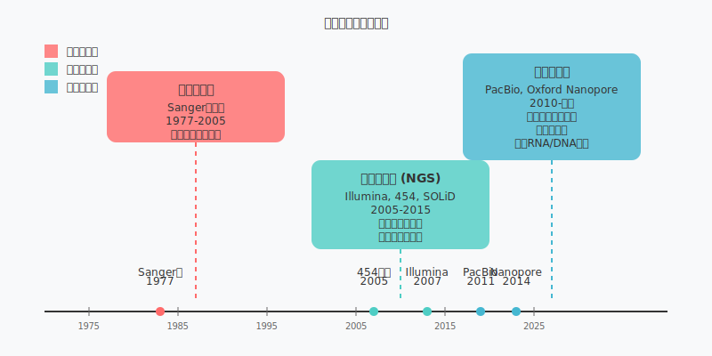
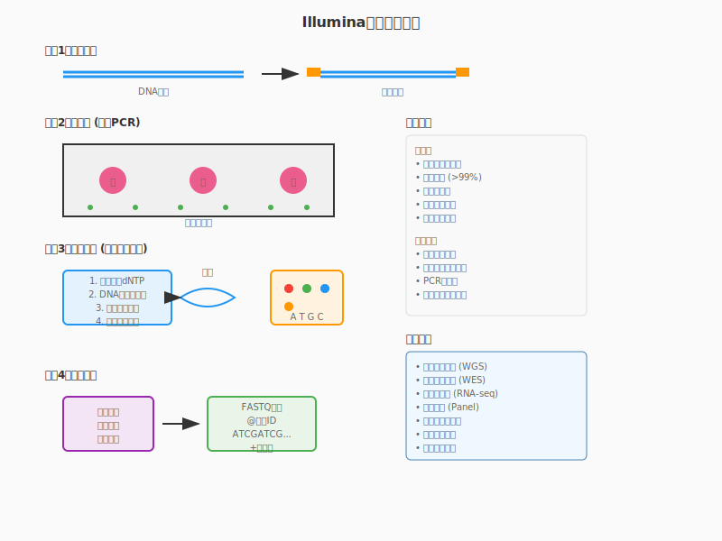
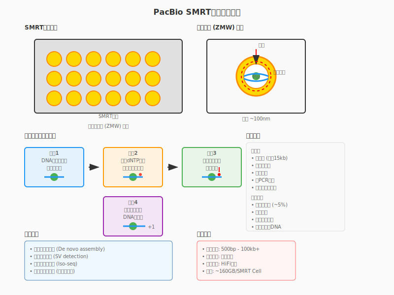
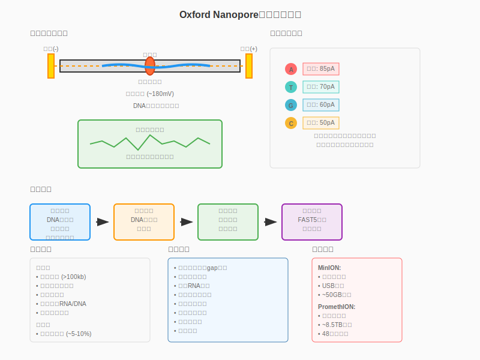

<!-- 
第1次课：测序技术原理与平台比较
课程名称：高通量测序数据分析
主讲教师：王运生教授
联系邮箱：wangys@hunau.edu.cn
办公室：16教420室
上课地点：105机房
-->

<!-- _class: title -->
# 第1次课：测序技术原理与平台比较
## 高通量测序数据分析

**主讲教师：** 王运生  
**联系邮箱：** wangys@hunau.edu.cn  
**办公室：** 16教420室  
**上课地点：** 105机房  

---

<!-- _class: toc -->
# 本次课程内容

1. **测序技术发展史**
2. **第一代测序技术**
3. **第二代测序技术（NGS）**
4. **第三代测序技术**
5. **主流平台技术原理**
6. **平台特征比较与选择**

---

**学习目标：**
- 理解测序技术的发展历程和技术演进
- 掌握主流测序平台的工作原理
- 能够根据研究需求选择合适的测序平台

---

<!-- _class: content -->
# 课程导入：为什么需要DNA测序？

## 生命科学研究的核心问题
- **基因组结构**：生物体的遗传信息如何组织？
- **基因功能**：基因如何调控生物学过程？
- **遗传变异**：个体间的差异如何产生？
- **疾病机制**：疾病与基因的关系是什么？

---

## DNA测序的重要意义
- 解读生命的"天书"
- 精准医学的基础
- 农业育种的指导
- 进化研究的工具

---

<!-- _class: content -->
# 第一部分：测序技术发展史

## 测序技术的三个时代

| 测序技术代 | 时间范围 | 代表技术 | 主要特点 | 典型应用 |
|-----------|----------|----------|----------|----------|
| **第一代测序** | 1977-2005 | Sanger测序法 | 高准确性，低通量 | 单基因测序，小规模项目 |
| **第二代测序** | 2005-2010 | Illumina，454，SOLiD | 高通量，短读长 | 全基因组测序，转录组分析 |
| **第三代测序** | 2010至今 | PacBio，Oxford Nanopore | 长读长，实时测序 | 复杂基因组组装，结构变异检测 |
---

<!-- _class: image -->
# 测序技术发展时间线



---

<!-- _class: content -->
# 第二部分：第一代测序技术

## Sanger测序法原理

### 基本原理
- **链终止法**：使用双脱氧核苷酸（ddNTP）
- **DNA聚合酶**：延伸引物合成互补链
- **终止反应**：ddNTP缺少3'-OH基团，无法继续延伸
- **产物分离**：毛细管电泳分离不同长度片段

### 反应体系
```
模板DNA + 引物 + DNA聚合酶 + dNTP + ddNTP + 缓冲液
```

---

<!-- _class: multi-column -->
# Sanger测序的优缺点

<div class="columns">
<div class="column">

## 优点
- **高准确性**：错误率 < 0.1%
- **长读长**：可达800-1000 bp
- **成熟技术**：标准化程度高
- **可靠性强**：重现性好
- **成本适中**：小规模项目经济

</div>

---

<div class="column">

## 缺点
- **通量低**：单次反应产出有限
- **速度慢**：大规模项目耗时长
- **人工操作**：自动化程度相对较低
- **成本高**：大规模项目成本昂贵
- **重复序列**：难以处理复杂区域

</div>
</div>

---

<!-- _class: content -->
# 第三部分：第二代测序技术（NGS）

## NGS技术的革命性突破

### 核心创新
- **大规模并行**：同时进行数百万个测序反应
- **固相测序**：在固体表面进行反应
- **光学检测**：实时监测测序过程
- **自动化程度高**：减少人工干预

---

### 技术特点
- **高通量**：单次运行产生GB级数据
- **短读长**：通常50-300 bp
- **成本效益**：大幅降低每碱基成本
- **标准化**：适合大规模项目

---

<!-- _class: content -->
# Illumina测序技术原理

## 1. 文库构建
- **DNA片段化**：物理或酶切方法
- **接头连接**：添加通用接头序列
- **PCR扩增**：增加模板浓度
- **质量控制**：检查片段大小分布

## 2. 簇生成（Cluster Generation）
- **桥式PCR**：在流动池表面扩增
- **单分子模板**：形成克隆簇
- **密度优化**：确保信号质量

---

<!-- _class: image -->
# Illumina测序流程图



---

<!-- _class: content -->
# Illumina测序检测原理

## 3. 测序反应
- **可逆终止子**：改良的ddNTP
- **四色荧光**：A、T、G、C不同颜色
- **循环反应**：加入→检测→切除→洗脱

## 4. 数据采集
- **光学系统**：激光激发，CCD检测
- **图像处理**：识别荧光信号
- **碱基识别**：转换为序列信息
- **质量评分**：Phred质量值

---

<!-- _class: code -->
# Illumina数据格式示例

## FASTQ格式
```
@SEQ_ID
GATTTGGGGTTCAAAGCAGTATCGATCAAATAGTAAATCCATTTGTTCAACTCACAGTTT
+
!''*((((***+))%%%++)(%%%%).1***-+*''))**55CCF>>>>>>CCCCCCC65
```

## 质量值含义
```
Phred Score = -10 * log10(P)
P = 错误概率

Q20: 1% 错误率
Q30: 0.1% 错误率  
Q40: 0.01% 错误率
```

---

<!-- _class: multi-column -->
# 其他第二代测序平台

<div class="columns">
<div class="column">

## 454测序（Roche）
- **原理**：焦磷酸测序
- **特点**：较长读长（400-700bp）
- **优势**：快速，适合小基因组
- **劣势**：同聚物错误
- **状态**：已停产

---

## Ion Torrent
- **原理**：半导体测序
- **特点**：快速，成本低
- **优势**：设备小型化
- **劣势**：同聚物错误

</div>
<div class="column">

## SOLiD（ABI）
- **原理**：连接酶测序
- **特点**：双碱基编码
- **优势**：高准确性
- **劣势**：数据处理复杂
- **状态**：已停产

## BGI/MGI
- **原理**：DNA纳米球技术
- **特点**：成本低廉
- **优势**：中国自主技术
- **应用**：大规模项目

</div>
</div>

---

<!-- _class: content -->
# 第四部分：第三代测序技术

## 长读长测序的需求

### NGS的局限性
- **短读长**：难以跨越重复区域
- **组装困难**：复杂基因组结构
- **结构变异**：大片段插入/缺失检测困难
- **相位信息**：无法确定单倍型

### 长读长的优势
- **跨越重复**：解决基因组"暗区"
- **结构变异**：直接检测大片段变异
- **转录本全长**：完整mRNA序列
- **表观遗传**：直接检测DNA修饰

---

<!-- _class: content -->
# PacBio测序技术

## SMRT技术原理
- **单分子实时测序**：Single Molecule Real-Time
- **零模波导**：纳米级反应孔
- **荧光标记**：磷酸基团标记
- **实时检测**：聚合酶工作时检测

---

## 技术特点
- **长读长**：平均10-15kb，最长可达100kb+
- **高错误率**：单分子错误率~15%
- **随机错误**：通过一致性序列校正
- **无PCR偏向**：直接测序原始DNA

---

<!-- _class: image -->



---

<!-- _class: content -->
# Oxford Nanopore测序技术

## 纳米孔测序原理
- **蛋白纳米孔**：生物或固态纳米孔
- **电流检测**：DNA通过时电流变化
- **实时测序**：边测序边输出数据
- **便携设备**：MinION手持设备

---

## 技术特点
- **超长读长**：理论上无限制，实际可达2Mb+
- **实时分析**：边测序边分析
- **便携性**：设备小型化
- **成本低**：入门门槛低
- **错误率**：持续改进中（~5-10%）

---

<!-- _class: image -->



---

<!-- _class: content -->
# 第五部分：主流平台技术比较

## 读长比较
| 平台 | 读长范围 | 平均读长 | 最大读长 |
|------|---------|---------|---------|
| Illumina | 50-300 bp | 150 bp | 300 bp |
| PacBio | 500bp-100kb | 10-15 kb | >100 kb |
| Nanopore | 100bp-2Mb | 10-30 kb | >2 Mb |
| Sanger | 200-1000 bp | 800 bp | 1000 bp |

---

## 准确性比较
| 平台 | 错误率 | 错误类型 | 校正方法 |
|------|--------|---------|---------|
| Illumina | 0.1-1% | 替换为主 | 质量值过滤 |
| PacBio | 1-5% | 随机错误 | 一致性序列 |
| Nanopore | 5-10% | 插入/缺失 | 算法校正 |
| Sanger | <0.1% | 随机错误 | 人工检查 |

---

<!-- _class: multi-column -->
# 通量和成本比较

<div class="columns">
<div class="column">

## 通量比较
| 平台 | 单次运行产出 |
|------|-------------|
| **Illumina NovaSeq** | 6 Tb |
| **Illumina HiSeq** | 1.5 Tb |
| **PacBio Sequel II** | 160 Gb |
| **Nanopore PromethION** | 8.5 Tb |
| **Nanopore MinION** | 50 Gb |

</div>

---

<div class="column">

## 成本比较（每Gb）
| 平台 | 成本范围 |
|------|---------|
| **Illumina** | $10-50 |
| **PacBio** | $100-500 |
| **Nanopore** | $50-200 |
| **Sanger** | $2000-5000 |

*注：成本会因规模、地区、时间而变化*

</div>
</div>

---

<!-- _class: content -->
# 第六部分：测序平台选择策略

## 应用场景导向的选择

### 全基因组测序
- **人类基因组**：Illumina + PacBio/Nanopore组合
- **微生物基因组**：Illumina或PacBio单独
- **植物基因组**：根据复杂度选择组合策略

---

### 转录组分析
- **基因表达定量**：Illumina短读长
- **转录本发现**：PacBio/Nanopore长读长
- **可变剪接**：长读长技术优势明显

### 表观基因组
- **甲基化检测**：Illumina bisulfite-seq
- **直接检测**：Nanopore原生检测

---

<!-- _class: multi-column -->
# 技术选择决策树

<div class="columns">
<div class="column">

## 考虑因素
### 项目需求
- 研究目标
- 精度要求
- 读长需求
- 通量需求

### 资源限制
- 预算约束
- 时间要求
- 设备可用性
- 技术能力

</div>

---

<div class="column">

## 决策流程
1. **明确研究目标**
2. **评估技术需求**
3. **比较平台特性**
4. **考虑成本效益**
5. **选择最优方案**

### 组合策略
- **混合测序**：短读长+长读长
- **分阶段测序**：先筛选后精测
- **多平台验证**：关键结果确认

</div>
</div>

---

<!-- _class: content -->
# 测序技术发展趋势

## 技术发展方向

### 准确性提升
- **算法优化**：更好的错误校正
- **化学改进**：更稳定的反应体系
- **硬件升级**：更精确的检测系统

---

### 成本降低
- **规模效应**：大规模生产降成本
- **技术简化**：减少复杂步骤
- **竞争加剧**：多厂商竞争

### 应用拓展
- **临床应用**：精准医学普及
- **现场检测**：便携设备发展
- **实时分析**：边测序边分析

---

<!-- _class: content -->
# 新兴测序技术

## 正在发展的技术

### 蛋白质测序
- **单分子蛋白质测序**：直接读取氨基酸序列
- **质谱技术结合**：提高检测精度

### 表观遗传直接检测
- **原生DNA检测**：无需化学处理
- **多种修饰同时检测**：全面表观信息

---

### 空间转录组
- **原位测序**：保持空间位置信息
- **单细胞分辨率**：细胞级别分析

### 实时长读长
- **准确性提升**：接近短读长精度
- **速度加快**：更快的测序速度

---

<!-- _class: content -->
# 测序数据的特点

## 数据量特征
- **海量数据**：TB级别数据产出
- **快速增长**：指数级增长趋势
- **存储挑战**：需要大容量存储系统
- **传输问题**：网络带宽要求高

---

## 数据质量
- **质量不均**：不同区域质量差异
- **系统偏向**：技术相关的偏向性
- **批次效应**：不同批次间差异
- **污染风险**：样本交叉污染

## 数据格式
- **标准格式**：FASTQ、SAM/BAM、VCF等
- **压缩存储**：减少存储空间需求
- **元数据**：样本信息和实验条件

---

<!-- _class: content -->
# 测序项目规划

## 项目设计要素

### 实验设计
- **样本选择**：代表性和对照组
- **样本量计算**：统计功效分析
- **随机化**：减少系统偏向
- **重复设置**：技术重复vs生物重复

---

### 质量控制
- **样本质量**：DNA/RNA完整性检查
- **文库质量**：片段大小和浓度
- **测序质量**：实时监控和调整
- **数据质量**：后续分析前评估

---

<!-- _class: content -->
# 测序伦理和法规

## 伦理考虑
- **知情同意**：参与者充分了解
- **隐私保护**：个人遗传信息安全
- **数据共享**：平衡开放与隐私
- **结果反馈**：是否告知个人结果

---

## 法规要求
- **数据保护法**：GDPR等隐私法规
- **生物安全**：样本处理和运输
- **质量标准**：临床应用质量要求
- **国际合作**：跨境数据传输规定

## 最佳实践
- **透明度**：公开方法和局限性
- **可重复性**：提供充分的方法细节
- **负责任创新**：考虑社会影响

---

<!-- _class: summary -->
# 本次课程总结

## 主要内容回顾
- **测序技术演进**：从Sanger到NGS再到第三代
- **平台技术原理**：Illumina、PacBio、Nanopore工作机制
- **技术特征比较**：读长、准确性、通量、成本对比
- **应用选择策略**：根据研究需求选择合适平台
- **发展趋势展望**：技术发展方向和新兴技术

---

## 关键概念
- 高通量并行测序
- 读长与准确性权衡
- 成本效益分析
- 技术组合策略

## 下次课程预告
- **主题**：测序数据质量控制与预处理
- **内容**：FastQC、MultiQC、数据清洗策略
- **准备**：安装质量控制软件，下载示例数据

---

<!-- _class: end -->
# 谢谢大家！

**有问题请联系：**
- 邮箱：wangys@hunau.edu.cn
- 办公室：16教420室

**课后作业：**
1. 阅读推荐文献，了解测序技术最新进展
2. 完成实践操作手册中的练习
3. 思考自己研究领域的测序技术选择
