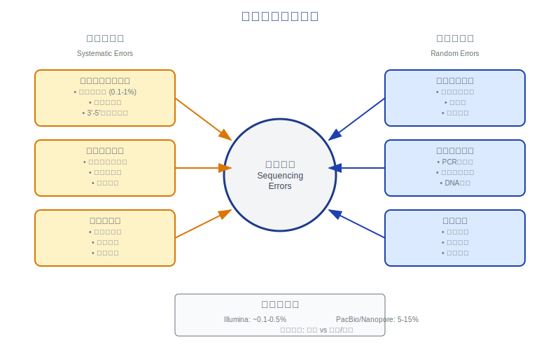
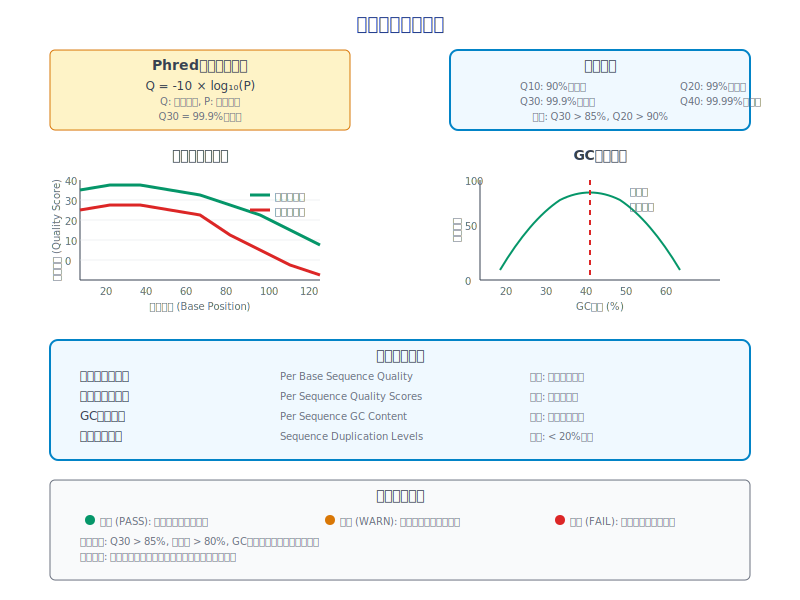
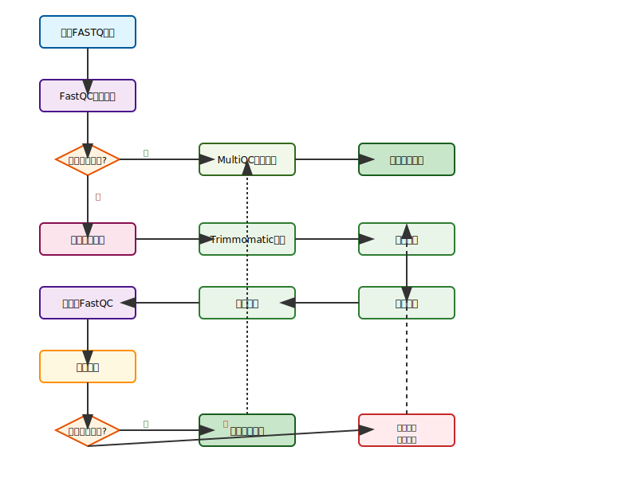
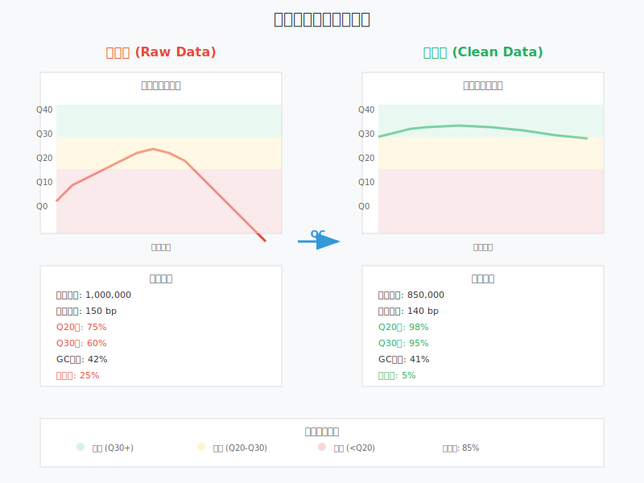

<!-- 
第2次课：测序数据质量控制与预处理
课程名称：高通量测序数据分析
主讲教师：王运生
联系邮箱：wangys@hunau.edu.cn
办公室：16教420室
上课地点：105机房
-->

<!-- _class: title -->
# 第2次课：测序数据质量控制与预处理
## 高通量测序数据分析

**主讲教师：** 王运生  
**联系邮箱：** wangys@hunau.edu.cn  
**办公室：** 16教420室  
**上课地点：** 105机房  

---

<!-- _class: toc -->
# 本次课程内容

1. **测序错误来源分析**
2. **质量评估指标体系**
3. **数据清洗策略**
4. **质量控制工具介绍**
5. **实践操作演示**

**学习目标：**
- 理解测序数据中各种错误的来源和特征
- 掌握质量评估的主要指标和方法
- 学会使用FastQC和MultiQC进行质量控制
- 掌握数据清洗的基本策略和工具

---

<!-- _class: content -->
# 为什么需要质量控制？

## 测序数据的特点
- **海量数据**：单次运行产生数GB到数TB的数据
- **复杂性高**：包含技术噪声和生物学变异
- **错误不可避免**：测序过程中必然引入各种错误

## 质量控制的重要性
- **保证分析准确性**：低质量数据导致错误结论
- **优化计算资源**：去除无用数据，提高效率
- **标准化流程**：建立可重复的分析标准

---

<!-- _class: content -->
# 第一部分：测序错误来源分析

## 测序错误的分类

### 系统性错误
- **测序化学反应**：聚合酶错误、终止子问题
- **光学系统**：激光功率不稳定、检测器噪声
- **流动池问题**：表面不均匀、气泡干扰

### 随机性错误
- **碱基识别**：信号强度不足、重叠峰
- **样本制备**：PCR偏好性、片段化不均匀
- **环境因素**：温度波动、振动干扰

---

<!-- _class: image -->
# 测序错误来源示意图



---

<!-- _class: content -->
# 测序化学反应中的错误

## 聚合酶相关错误
- **掺入错误**：错误碱基的掺入（~0.1-1%）
- **滑链现象**：重复序列区域的滑动
- **3'-5'外切酶活性**：校对功能的局限性

## 终止子相关问题
- **不完全终止**：信号强度不足
- **假终止**：非特异性终止
- **终止子降解**：化学稳定性问题

---

## 影响因素
- **反应温度**：影响酶活性和特异性
- **离子浓度**：Mg²⁺、Mn²⁺浓度
- **pH值**：缓冲体系的稳定性

---

<!-- _class: content -->
# 光学系统引入的噪声

## 激光系统问题
- **功率不稳定**：导致信号强度变化
- **波长漂移**：影响荧光激发效率
- **光路污染**：灰尘、指纹等干扰

## 检测系统问题
- **CCD噪声**：暗电流、读出噪声
- **光谱串扰**：不同荧光通道间的干扰
- **像素缺陷**：坏点、热点问题

---

<!-- _class: content -->
# 碱基识别算法的局限性
## 数据处理算法
- **基线校正**：背景信号的处理
- **信号分离**：重叠峰的分离算法
- **质量评分**：Phred分数的计算

---

<!-- _class: multi-column -->
# 不同测序平台的错误特征

<div class="columns">
<div class="column">

## Illumina平台
- **主要错误**：替换错误
- **错误率**：~0.1-0.5%
- **质量下降**：读长末端明显
- **GC偏好性**：轻微偏好
- **特征**：质量分数可靠

</div>

---

<div class="column">

## PacBio/Nanopore
- **主要错误**：插入/缺失
- **错误率**：5-15%（原始数据）
- **质量分布**：相对均匀
- **长度优势**：可达数十kb
- **特征**：随机错误为主

</div>
</div>

---

<!-- _class: content -->
# 第二部分：质量评估指标体系

## Phred质量分数系统

### 定义和计算
```
Q = -10 × log₁₀(P)
```
其中：
- **Q**：Phred质量分数
- **P**：碱基识别错误的概率

---

### 常用质量标准
- **Q10**：错误率10%（90%准确率）
- **Q20**：错误率1%（99%准确率）
- **Q30**：错误率0.1%（99.9%准确率）
- **Q40**：错误率0.01%（99.99%准确率）

---

<!-- _class: content -->
# 每碱基质量分布分析

## 正常质量分布特征
- **起始位置**：通常质量较高（Q30+）
- **中间区域**：质量稳定
- **末端区域**：质量逐渐下降
- **整体趋势**：平滑的质量曲线

---

## 异常模式识别
- **急剧下降**：可能的技术问题
- **周期性波动**：系统性偏差
- **异常峰值**：特定位置的问题
- **整体偏低**：测序质量差

---

<!-- _class: content -->
# 每序列质量分布分析

## 质量分布模式
- **正常分布**：大部分序列质量集中在高分区
- **双峰分布**：可能存在两种不同质量的数据
- **左偏分布**：整体质量偏低
- **异常分布**：需要进一步调查

---

## 评估标准
- **平均质量**：序列平均Phred分数
- **质量范围**：最高和最低质量的差异
- **分布形状**：正态性检验
- **异常值**：极端质量值的比例

---

<!-- _class: content -->
# GC含量分析

## 理论GC含量
- **人类基因组**：约41%
- **细菌基因组**：25-75%变化范围
- **病毒基因组**：高度变异

## GC偏差的原因
- **PCR偏好性**：GC富集区域扩增困难
- **测序偏好性**：平台特异性偏差
- **污染问题**：外源DNA的混入
- **样本问题**：DNA降解或修饰

## 评估方法
- **理论值比较**：与参考基因组比较
- **分布形状**：正态分布检验
- **异常峰值**：污染序列识别

---

<!-- _class: image -->
# 质量评估指标图表



---

<!-- _class: content -->
# 序列长度分布分析

## 预期长度分布
- **单端测序**：固定长度（如150bp）
- **双端测序**：两个固定长度
- **长读长测序**：广泛的长度分布

---

## 实际长度分布
## 异常长度模式
- **长度截断**：质量过滤导致的截断
- **异常短序列**：接头二聚体等
- **长度偏差**：样本制备问题
- **多峰分布**：多种文库的混合

## 影响因素
- **片段化方法**：物理vs化学片段化
- **文库制备**：大小选择的效果
- **测序策略**：读长设置

---

<!-- _class: content -->
# 重复序列检测

## 重复序列的类型
- **PCR重复**：扩增过程中的人工重复
- **光学重复**：同一簇的重复读取
- **生物学重复**：基因组中的天然重复
- **接头序列**：文库制备中的接头

---

## 检测方法
- **序列比对**：完全匹配的序列
- **起始位置**：相同起始位置的reads
- **质量模式**：相似的质量分布
- **统计分析**：重复频率的统计

## 处理策略
- **标记重复**：保留但标记
- **去除重复**：完全删除
- **质量选择**：保留最高质量的副本

---

<!-- _class: content -->
# 第三部分：数据清洗策略

## 数据清洗的目标

### 提高数据质量
- **去除低质量碱基**：提高整体准确性
- **统一序列长度**：便于后续分析
- **减少噪声**：降低假阳性率

### 优化分析效率
- **减少数据量**：节省计算资源
- **标准化格式**：统一数据格式
- **提高速度**：加快分析进程

---

<!-- _class: content -->
# 低质量碱基修剪

## 修剪策略
- **固定长度修剪**：从末端修剪固定长度
- **质量阈值修剪**：基于质量分数修剪
- **滑动窗口修剪**：使用滑动窗口算法
- **自适应修剪**：根据质量分布自适应

---

## 参数设置
- **质量阈值**：通常设置为Q20或Q30
- **窗口大小**：滑动窗口的大小（如4bp）
- **最小长度**：修剪后保留的最小长度
- **修剪方向**：5'端、3'端或两端

## 修剪算法示例
```
滑动窗口算法：
1. 设置窗口大小（如4bp）和质量阈值（如Q20）
2. 从3'端开始滑动窗口
3. 计算窗口内平均质量
4. 如果低于阈值，修剪该位置及之后的序列
```

---

<!-- _class: content -->
# 接头序列去除

## 接头序列的来源
- **通用接头**：Illumina标准接头序列
- **索引序列**：样本标记序列
- **接头二聚体**：接头自连形成的短片段
- **污染接头**：其他实验的接头残留

---

## 检测方法
- **序列比对**：与已知接头序列比对
- **k-mer分析**：高频k-mer的识别
- **长度分析**：异常短序列的检测
- **质量模式**：接头区域的质量特征

## 去除策略
- **硬修剪**：完全去除匹配的接头序列
- **软修剪**：部分去除或标记
- **严格匹配**：要求完全匹配
- **模糊匹配**：允许少量错配

---

<!-- _class: multi-column -->
# 常见接头序列

<div class="columns">
<div class="column">

## Illumina接头
```
TruSeq Universal Adapter:
AATGATACGGCGACCACCGAGATCTACAC

TruSeq Indexed Adapter:
GATCGGAAGAGCACACGTCTGAACTCCAGTCAC

Nextera Transposase Sequence:
CTGTCTCTTATACACATCT
```

</div>

---

<div class="column">

## 其他平台接头
```
Ion Torrent:
CCATCTCATCCCTGCGTGTCTCCGACTCAG

SOLiD:
CGCCTTGGCCGTACAGCAG

PacBio:
ATCTCTCTCTTTTCCTCCTCCTCCGTTGTTGTTGTTGAGAGAGAT
```

</div>
</div>

---

<!-- _class: content -->
# 重复序列处理

## 重复序列的影响
- **分析偏差**：人为增加某些区域的覆盖度
- **资源浪费**：占用不必要的计算资源
- **统计问题**：影响统计分析的准确性
- **假阳性**：增加变异检测的假阳性率

---

## 识别方法
- **完全匹配**：序列完全相同
- **起始位置匹配**：相同的比对起始位置
- **质量模式匹配**：相似的质量分布模式
- **统计学方法**：基于概率的重复检测

## 处理选择
- **保留标记**：标记但不删除
- **完全去除**：删除所有重复
- **保留最佳**：保留质量最高的副本
- **随机保留**：随机选择一个副本

---

<!-- _class: content -->
# 污染序列过滤

## 污染来源
- **宿主DNA**：细菌样本中的人类DNA
- **载体序列**：克隆载体的残留
- **试剂污染**：实验试剂中的DNA
- **交叉污染**：不同样本间的污染

---

## 检测策略
- **参考数据库比对**：与已知污染序列比对
- **物种特异性分析**：基于物种特征的过滤
- **GC含量分析**：异常GC含量的序列
- **k-mer分析**：异常k-mer频率分析

## 过滤方法
- **黑名单过滤**：基于已知污染序列列表
- **相似性过滤**：基于序列相似性
- **统计过滤**：基于统计学异常
- **手动检查**：人工验证可疑序列

---

<!-- _class: content -->
# 长度过滤策略

## 长度过滤的必要性
- **分析要求**：某些分析需要特定长度范围
- **质量保证**：过短序列通常质量较差
- **效率优化**：去除无用的短序列
- **标准化**：统一序列长度分布

---

## 过滤参数
- **最小长度**：通常设置为原长度的50-70%
- **最大长度**：去除异常长的序列
- **长度分布**：保持合理的长度分布
- **双端配对**：保持配对reads的一致性

---

## 实施策略
```bash
# 示例：保留长度在50-150bp之间的序列
minimum_length=50
maximum_length=150

# 过滤命令示例
trimmomatic PE input_R1.fastq input_R2.fastq \
    output_R1.fastq unpaired_R1.fastq \
    output_R2.fastq unpaired_R2.fastq \
    MINLEN:${minimum_length} MAXLEN:${maximum_length}
```

---

<!-- _class: content -->
# 第四部分：质量控制工具介绍

## FastQC - 快速质量控制

### 主要功能
- **基本统计**：序列数量、长度分布、GC含量
- **质量分析**：每碱基和每序列质量分布
- **序列分析**：重复序列、接头污染检测
- **报告生成**：HTML格式的详细报告

### 优势特点
- **速度快**：高效的算法实现
- **易使用**：简单的命令行界面

---

<!-- _class: content -->
# FastQC分析模块详解

## 基本统计模块
- **Total Sequences**：总序列数
- **Sequence Length**：序列长度范围
- **%GC**：GC含量百分比
- **Encoding**：质量编码格式

---

## 质量分析模块
- **Per Base Sequence Quality**：每个位置的质量分布
- **Per Sequence Quality Scores**：每条序列的质量分布
- **Per Base N Content**：每个位置的N碱基含量

## 序列内容分析
- **Per Base Sequence Content**：每个位置的碱基组成
- **Per Sequence GC Content**：GC含量分布
- **Sequence Duplication Levels**：序列重复水平
- **Overrepresented Sequences**：过度表达序列

---

<!-- _class: content -->
# FastQC报告解读

## 通过/警告/失败标准

### 通过（绿色）✅
- 质量分数中位数 > Q25
- GC含量偏差 < 15%
- 重复序列 < 20%

---

### 警告（黄色）⚠️
- 质量分数中位数 Q20-Q25
- GC含量偏差 15-30%
- 重复序列 20-50%

### 失败（红色）❌
- 质量分数中位数 < Q20
- GC含量偏差 > 30%
- 重复序列 > 50%

---

<!-- _class: content -->
# MultiQC - 多样本整合分析

### 核心功能
- **报告整合**：将多个FastQC报告整合为一个
- **趋势分析**：识别样本间的质量趋势
- **异常检测**：自动识别异常样本
- **交互式图表**：支持交互式数据探索

---

### 支持的工具
- **质量控制**：FastQC, AfterQC, Clumpify
- **比对工具**：BWA, Bowtie2, STAR, HISAT2
- **变异检测**：GATK, FreeBayes, VarScan
- **定量分析**：featureCounts, Salmon, Kallisto

### 输出格式
- **HTML报告**：交互式网页报告
- **数据表格**：CSV格式的原始数据
- **图片文件**：PNG/SVG格式的图表

---

<!-- _class: image -->
# 质量控制工作流程



---

<!-- _class: content -->
# 其他质量控制工具

## Trimmomatic
- **功能**：序列修剪和过滤
- **特点**：支持双端测序，参数丰富
- **适用**：Illumina数据处理

## Cutadapt
- **功能**：接头去除和序列修剪
- **特点**：支持多种接头类型
- **适用**：各种测序平台

---

## fastp
- **功能**：一体化质量控制和预处理
- **特点**：速度快，功能全面
- **适用**：现代化的QC工具

## AfterQC
- **功能**：自动质量控制和修复
- **特点**：智能化处理，减少人工干预
- **适用**：批量样本处理

---

<!-- _class: multi-column -->
# 工具选择策略

<div class="columns">
<div class="column">

## 基础质量评估
- **FastQC**：标准选择
- **MultiQC**：多样本整合
- **适用场景**：所有项目

## 数据清洗
- **Trimmomatic**：功能全面
- **fastp**：速度优先
- **Cutadapt**：接头专用

</div>

---

<div class="column">

## 特殊需求
- **长读长数据**：NanoPlot, LongQC
- **单细胞数据**：CellRanger, alevin
- **宏基因组**：KneadDATA, MetaWRAP

## 选择原则
- **数据类型**：匹配数据特征
- **分析需求**：满足下游分析
- **计算资源**：考虑效率要求

</div>
</div>

---

<!-- _class: content -->
# 第五部分：实践操作演示

## 实验环境准备

### 软件安装
```bash
# 安装FastQC
sudo apt-get install fastqc

# 安装MultiQC
pip install multiqc

# 安装Trimmomatic
conda install -c bioconda trimmomatic

# 验证安装
fastqc --version
multiqc --version
trimmomatic -version
```

---

### 数据准备
- **测试数据集**：SRA公共数据
- **文件格式**：FASTQ格式
- **数据大小**：适中的样本量
- **质量特征**：包含典型的质量问题

---

<!-- _class: code -->
# FastQC基本使用

```bash
# 单个文件分析
fastqc sample.fastq.gz

# 批量分析
fastqc *.fastq.gz

# 指定输出目录
fastqc -o output_dir/ *.fastq.gz

# 设置线程数
fastqc -t 4 *.fastq.gz

# 生成报告
# 输出：sample_fastqc.html 和 sample_fastqc.zip
```

---

<!-- _class: code -->
# MultiQC整合分析

```bash
# 基本使用
multiqc .

# 指定输入目录
multiqc fastqc_results/

# 自定义报告名称
multiqc -n my_project_report .

# 包含特定工具结果
multiqc --cl_config "{'fastqc': {'general_stats_target_coverage': [20, 40, 70, 80, 90, 95, 99]}}" .

# 生成数据表格
multiqc --export .
```

---

<!-- _class: code -->
# Trimmomatic数据清洗

```bash
# 双端测序数据清洗
trimmomatic PE -threads 4 \
    input_R1.fastq.gz input_R2.fastq.gz \
    output_R1_paired.fastq.gz output_R1_unpaired.fastq.gz \
    output_R2_paired.fastq.gz output_R2_unpaired.fastq.gz \
    ILLUMINACLIP:TruSeq3-PE.fa:2:30:10 \
    LEADING:3 TRAILING:3 \
    SLIDINGWINDOW:4:15 \
    MINLEN:36

# 参数说明：
# ILLUMINACLIP: 去除接头序列
# LEADING/TRAILING: 去除首尾低质量碱基
# SLIDINGWINDOW: 滑动窗口质量修剪
# MINLEN: 最小长度过滤
```

---

<!-- _class: content -->
# 质量控制效果评估

## 清洗前后对比
- **序列数量变化**：评估数据损失程度
- **质量分布改善**：质量分数的提升
- **长度分布变化**：修剪对长度的影响
- **GC含量稳定性**：确保无偏差引入

---

## 评估指标
- **保留率**：清洗后保留的序列比例
- **质量提升**：平均质量分数的改善
- **一致性**：样本间质量的一致性
- **下游兼容性**：是否满足后续分析需求

## 质量标准
- **Q30比例**：> 85%为优秀
- **保留率**：> 80%为可接受
- **长度分布**：保持合理的分布形状

---

<!-- _class: image -->
# 质量控制前后对比



---

<!-- _class: content -->
# 批量处理脚本示例

## 自动化质量控制流程
```bash
#!/bin/bash
# 批量质量控制脚本

# 设置参数
INPUT_DIR="raw_data"
OUTPUT_DIR="qc_results"
THREADS=8

# 创建输出目录
mkdir -p ${OUTPUT_DIR}/{fastqc,multiqc,trimmed}

# 运行FastQC
echo "运行FastQC分析..."
fastqc -t ${THREADS} -o ${OUTPUT_DIR}/fastqc ${INPUT_DIR}/*.fastq.gz

# 运行MultiQC
echo "生成MultiQC报告..."
multiqc -o ${OUTPUT_DIR}/multiqc ${OUTPUT_DIR}/fastqc

# 数据清洗
echo "执行数据清洗..."
for file in ${INPUT_DIR}/*_R1.fastq.gz; do
    base=$(basename ${file} _R1.fastq.gz)
    trimmomatic PE -threads ${THREADS} \
        ${INPUT_DIR}/${base}_R1.fastq.gz \
        ${INPUT_DIR}/${base}_R2.fastq.gz \
        ${OUTPUT_DIR}/trimmed/${base}_R1_paired.fastq.gz \
        ${OUTPUT_DIR}/trimmed/${base}_R1_unpaired.fastq.gz \
        ${OUTPUT_DIR}/trimmed/${base}_R2_paired.fastq.gz \
        ${OUTPUT_DIR}/trimmed/${base}_R2_unpaired.fastq.gz \
        ILLUMINACLIP:TruSeq3-PE.fa:2:30:10 \
        LEADING:3 TRAILING:3 SLIDINGWINDOW:4:15 MINLEN:36
done

echo "质量控制完成！"
```

---

<!-- _class: content -->
# 质量控制最佳实践

## 分析前准备
- **了解数据来源**：测序平台、文库制备方法
- **设定质量标准**：根据下游分析需求
- **准备参考数据**：接头序列、污染序列列表
- **规划存储空间**：确保足够的磁盘空间

---

## 参数优化
- **质量阈值**：根据数据特征调整
- **长度过滤**：平衡质量和数据量
- **接头去除**：使用正确的接头序列
- **批量处理**：优化计算效率

## 结果验证
- **多工具验证**：使用不同工具交叉验证
- **手动检查**：抽查部分结果
- **下游兼容性**：确保满足后续分析需求

---

<!-- _class: content -->
# 常见问题和解决方案

## 质量分数异常低
**可能原因：**
- 测序试剂老化
- 流动池问题
- 样本质量差

**解决方案：**
- 降低质量阈值
- 增加修剪力度
- 考虑重新测序

---

## GC含量异常
**可能原因：**
- 样本污染
- PCR偏好性
- 接头污染

**解决方案：**
- 污染序列过滤
- 优化PCR条件
- 彻底去除接头

---

<!-- _class: content -->
# 质量控制报告解读技巧

## 关注重点指标
- **整体质量趋势**：是否符合预期
- **异常样本识别**：偏离群体的样本
- **批次效应**：不同批次间的差异
- **技术重复一致性**：重复样本的相似性

---

## 决策标准
- **可接受标准**：Q20 > 90%, Q30 > 80%
- **需要清洗**：存在明显质量问题
- **需要重测**：质量过差无法挽救
- **可直接使用**：质量优秀，无需处理

## 文档记录
- **参数设置**：记录所有处理参数
- **质量统计**：保存关键质量指标
- **处理日志**：记录处理过程和问题
- **版本信息**：记录软件版本

---

<!-- _class: summary -->
# 本次课程总结

## 主要内容回顾
- **错误来源**：理解测序过程中各种错误的产生机制
- **质量评估**：掌握Phred分数系统和各种质量指标
- **清洗策略**：学会选择合适的数据清洗方法
- **工具使用**：熟练使用FastQC和MultiQC进行质量控制

---

## 关键技能
- **质量报告解读**：能够准确解读QC报告
- **参数优化**：根据数据特征调整处理参数
- **批量处理**：编写自动化处理脚本
- **问题诊断**：识别和解决常见质量问题

## 下次课程预告
- **主题**：序列比对算法与工具
- **内容**：BWA、Bowtie2等比对工具的使用
- **准备**：安装比对软件，下载参考基因组

---

<!-- _class: end -->
# 谢谢大家！

**课后作业：**
- 完成实践操作手册中的所有练习
- 提交一份完整的质量控制报告
- 思考：如何根据质量控制结果优化实验设计？

**有问题请联系：**
- 邮箱：wangys@hunau.edu.cn
- 办公室：16教420室