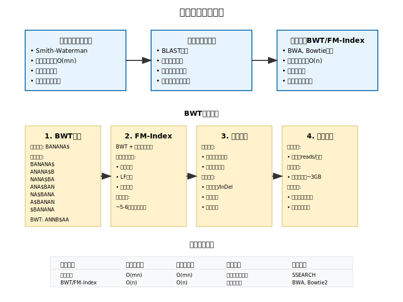
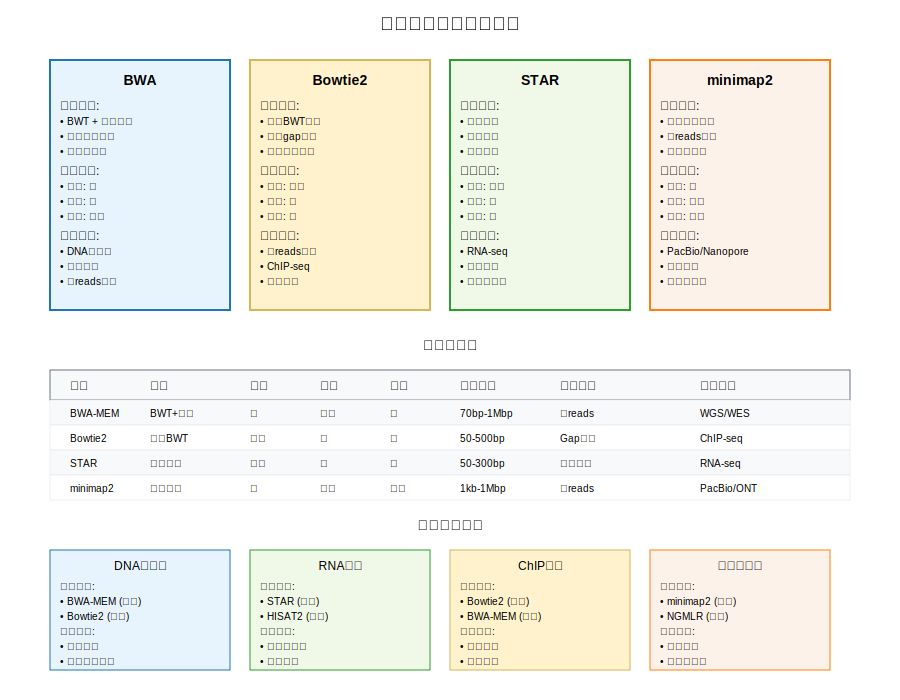
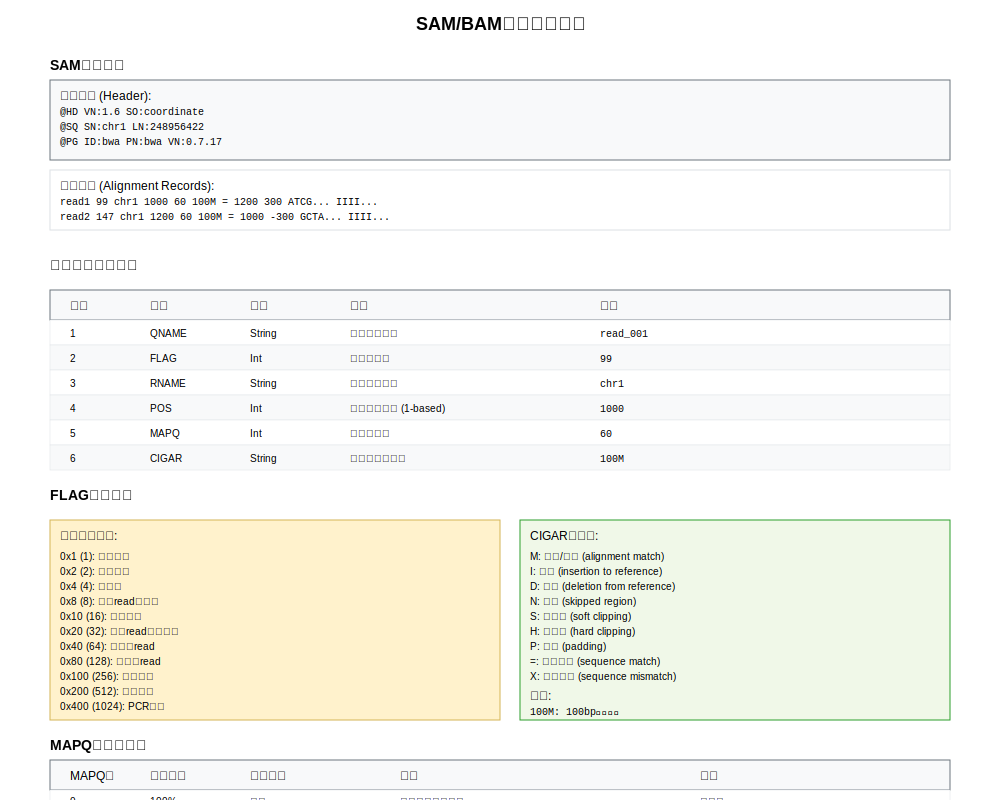

<!-- _class: title -->
# 第3次课：高通量测序序列比对算法与工具
## 高通量测序数据分析

**主讲教师：** 王运生  
**联系邮箱：** wangys@hunau.edu.cn  
**办公室：** 16教420室  
**上课地点：** 105机房

---

<!-- _class: toc -->
# 本次课程内容

1. **序列比对基础概念**
2. **比对算法原理**
3. **主流比对工具介绍**
7. **比对策略与参数优化**
8. **SAM/BAM文件格式**
9. **比对质量评估**

---

# 学习目标
- 理解序列比对算法原理
- 掌握BWA和Bowtie2工具使用
- 学会比对结果质量评估

---

<!-- _class: content -->
# 序列比对基础概念

## 什么是序列比对？

将测序得到的短序列（reads）与参考基因组进行匹配，确定每个read在基因组上的位置

## 核心挑战
- **数据量大**：数百万到数十亿条reads
- **序列短**：通常50-300bp
- **存在错误**：测序错误、SNP、InDel
- **重复序列**：基因组中的重复区域
- **速度要求**：需要在合理时间内完成

---

<!-- _class: content -->
# 比对的类型

## 按比对策略分类

<div class="columns">
<div class="column">

### 1. 全局比对 (Global Alignment)
- 比对整个序列
- 适用于相似度高的序列
- 算法：Needleman-Wunsch

### 2. 局部比对 (Local Alignment)  
- 寻找最佳匹配片段
- 适用于部分相似的序列
- 算法：Smith-Waterman

</div>
<div class="column">

### 3. 半全局比对 (Semi-global Alignment)
- 允许末端不匹配
- 适用于测序reads比对

</div>
</div>

---

<!-- _class: image -->
# 比对算法演进



---

<!-- _class: content -->
# Burrows-Wheeler Transform (BWT)

<div class="columns">
<div class="column">

## BWT的基本思想
将字符串进行特殊变换，使相似字符聚集在一起，便于压缩和快速搜索

</div>
<div class="column">

## BWT变换步骤
1. 在字符串末尾添加特殊字符$
2. 生成所有循环移位
3. 按字典序排序
4. 取最后一列作为BWT结果

```
原字符串: BANANA$
BWT结果:  ANNB$AA
```
</div>
</div>

---

<!-- _class: content -->
# BWT在序列比对中的应用

<div class="columns">
<div class="column">

## FM-Index结构
- **BWT + 后缀数组采样**
- 支持快速的精确匹配
- 内存使用量小


## 搜索算法
1. **后向搜索**：从查询序列末尾开始
2. **LF映射**：利用BWT的性质快速定位
3. **范围缩小**：逐步缩小匹配范围

</div>
<div class="column">

## 优势
- 内存效率高
- 搜索速度快
- 支持精确和近似匹配

</div>
</div>

---

<!-- _class: content -->
# 种子匹配策略

## 基本思想
将长序列分解为短的"种子"，先进行精确匹配，再扩展

<div class="columns">
<div class="column">

### 1. 连续种子
- 固定长度的连续子串
- 简单但对错误敏感

### 2. 间隔种子 (Spaced Seeds)
- 允许特定位置的不匹配
- 提高对错误的容忍度

</div>
<div class="column">

### 3. 多重种子
- 使用多个不同的种子模式
- 提高敏感性

</div>
</div>

---

<!-- _class: image -->
# 主流比对工具比较



---

<!-- _class: content -->
# BWA工具套件

## BWA包含的算法

<div class="columns">
<div class="column">

### 1. BWA-backtrack (bwa aln)
- 适用于短reads (<100bp)
- 基于回溯搜索
- 精确但速度较慢

### 2. BWA-SW (bwa bwasw)
- 适用于长reads (>100bp)
- 基于Smith-Waterman
- 支持长InDel

</div>
<div class="column">

### 3. BWA-MEM (bwa mem)
- **推荐使用**
- 适用于70bp-1Mbp的reads
- 结合种子匹配和局部比对

</div>
</div>

---

<!-- _class: content -->
# BWA-MEM算法流程


<div class="columns">
<div class="column">

## 第一阶段：种子匹配
1. **SMEM查找**：寻找超级最大精确匹配
2. **种子过滤**：去除过短或重复的种子
3. **种子排序**：按基因组位置排序

## 第二阶段：种子扩展
1. **链式连接**：将相邻种子连成链
2. **局部比对**：使用Smith-Waterman扩展
3. **评分排序**：计算比对得分

</div>
<div class="column">

## 第三阶段：后处理
1. **配对信息**：处理paired-end reads
2. **比对质量**：计算MAPQ值
3. **输出格式**：生成SAM格式结果

</div>
</div>

---

<!-- _class: content -->
# BWA-MEM的优势

<div class="columns">
<div class="column">

## 算法优势
- **快速**：线性时间复杂度
- **准确**：高质量的比对结果
- **鲁棒**：对测序错误容忍度高
- **灵活**：支持多种读长

</div>
<div class="column">

## 实用特性
- **自动参数**：大多数情况下使用默认参数
- **配对感知**：智能处理paired-end数据
- **多线程**：支持并行计算
- **内存效率**：索引文件相对较小

</div>
</div>

---

<!-- _class: content -->
# Bowtie2算法特点

<div class="columns">
<div class="column">

## 与Bowtie的区别
- **支持gap**：允许插入和删除
- **局部比对**：支持软剪切
- **更长reads**：适用于更长的测序reads
- **更快速度**：优化的算法实现

</div>
<div class="column">

## 核心算法
- **双向BWT**：正向和反向BWT索引
- **动态规划**：处理gap和错配
- **多阶段搜索**：从严格到宽松的搜索策略

</div>
</div>

---

<!-- _class: content -->
# Bowtie2比对流程

<div class="columns">
<div class="column">

## 第一阶段：精确匹配搜索
1. **种子提取**：从read中提取多个种子
2. **精确搜索**：在BWT索引中查找精确匹配
3. **扩展验证**：验证种子周围区域

## 第二阶段：近似匹配搜索
1. **允许错配**：逐步增加允许的错配数
2. **gap处理**：使用动态规划处理InDel
3. **评分计算**：根据比对质量计算得分

</div>
<div class="column">

## 第三阶段：结果选择
1. **多重比对**：处理多个可能的比对位置
2. **最佳选择**：选择得分最高的比对
3. **质量评估**：计算比对置信度

</div>
</div>

---

<!-- _class: content -->
# Bowtie2参数调优

<div class="columns">
<div class="column">

## 敏感性参数
```bash
--very-fast        # 最快速度，低敏感性
--fast            # 快速，中等敏感性  
--sensitive       # 默认，平衡速度和敏感性
--very-sensitive  # 最高敏感性，较慢速度
```

## 比对模式
```bash
--end-to-end      # 端到端比对（默认）
--local           # 局部比对，允许软剪切
```

</div>
<div class="column">

## 配对参数
```bash
-I <int>          # 最小插入片段长度
-X <int>          # 最大插入片段长度
--no-mixed        # 禁止单端比对
--no-discordant   # 禁止不一致配对
```

</div>
</div>

---

<!-- _class: multi-column -->
# Bowtie2 vs BWA-MEM

<div class="columns">
<div class="column">

## Bowtie2
- **速度**: 中等
- **内存使用**: 低
- **参数调节**: 丰富
- **长reads支持**: 好
- **gap处理**: 优秀
- **适用场景**: 需要精细参数控制，内存受限

</div>
<div class="column">

## BWA-MEM
- **速度**: 快
- **内存使用**: 中等
- **参数调节**: 简单
- **长reads支持**: 优秀
- **gap处理**: 好
- **适用场景**: 追求速度，处理长reads

</div>
</div>

---

<!-- _class: content -->
# 性能评估指标

<div class="columns">
<div class="column">

## 准确性指标
- **敏感性** (Sensitivity)：正确比对的reads比例
- **特异性** (Specificity)：比对结果的准确性
- **精确率** (Precision)：正确比对占所有比对的比例

## 效率指标
- **运行时间**：完成比对所需时间
- **内存使用**：峰值内存消耗
- **CPU利用率**：多核处理器使用效率

</div>
<div class="column">

## 实用性指标
- **易用性**：参数设置的复杂度
- **稳定性**：不同数据集的表现一致性
- **兼容性**：与下游分析工具的兼容性

</div>
</div>

---

<!-- _class: content -->
# 基准测试结果

## 模拟数据测试 (100M paired-end reads)

| 工具 | 运行时间 | 内存使用 | 正确比对率 |
|------|----------|----------|------------|
| **BWA-MEM** | 45分钟 | 5.2GB | 98.5% |
| **Bowtie2** | 62分钟 | 3.8GB | 98.2% |
| **STAR** | 28分钟 | 28GB | 97.8% |
| **minimap2** | 35分钟 | 6.1GB | 98.1% |

---

## 真实数据测试 (Human WGS 30X)

| 工具 | 总时间 | 比对率 | 唯一比对率 |
|------|--------|--------|------------|
| **BWA-MEM** | 8小时 | 99.1% | 95.2% |
| **Bowtie2** | 12小时 | 98.8% | 94.8% |

---

<!-- _class: content -->
# 不同数据类型的工具选择

<div class="columns">
<div class="column">

## DNA重测序 (WGS/WES)
**推荐**：BWA-MEM, Bowtie2
- 需要高精度的变异检测
- 对InDel检测要求高

## RNA测序 (RNA-seq)
**推荐**：STAR, HISAT2
- 需要处理剪接位点
- 对转录本定量精度要求高

</div>
<div class="column">

## ChIP测序 (ChIP-seq)
**推荐**：BWA-MEM, Bowtie2
- 片段长度相对固定
- 对比对精度要求中等

## 长读长测序
**推荐**：minimap2, NGMLR
- 专门优化长reads比对
- 支持高错误率数据

</div>
</div>

---

<!-- _class: content -->
# 比对策略选择

## 根据研究目标选择

<div class="columns">
<div class="column">

### 1. 变异检测
- **工具**：BWA-MEM + GATK
- **策略**：高精度比对，严格质控
- **参数**：默认参数，关注MAPQ

### 2. 拷贝数变异
- **工具**：BWA-MEM
- **策略**：保留多重比对
- **参数**：-a参数输出所有比对

</div>
<div class="column">

### 3. 结构变异
- **工具**：BWA-MEM, minimap2
- **策略**：软剪切信息保留
- **参数**：增大插入片段范围

</div>
</div>

---

<!-- _class: content -->
# BWA-MEM参数优化

## 核心参数
<div class="columns">
<div class="column">

### 种子长度 (-k)
```bash
-k 19    # 默认值，适合大多数情况
-k 15    # 更短种子，提高敏感性
-k 25    # 更长种子，提高特异性
```

### 带宽 (-w)
```bash
-w 100   # 默认值
-w 200   # 增加带宽，处理长InDel
```

</div>
<div class="column">

### 评分参数
```bash
-A 1     # 匹配得分
-B 4     # 错配罚分
-O 6     # gap开启罚分
-E 1     # gap延伸罚分
```
</div>
</div>

---

<!-- _class: image -->
# SAM/BAM文件格式



---

<!-- _class: content -->
# SAM格式概述

## SAM (Sequence Alignment/Map)
- **文本格式**：人类可读的比对结果
- **标准化**：生物信息学标准格式
- **完整信息**：包含所有比对细节

## 文件结构
```
@HD VN:1.6 SO:coordinate
@SQ SN:chr1 LN:248956422
@PG ID:bwa PN:bwa VN:0.7.17
read1 99  chr1 1000 60 100M = 1200 300 ATCG... IIII...
read2 147 chr1 1200 60 100M = 1000 -300 GCTA... IIII...
```

---

<!-- _class: content -->
# SAM比对记录字段

## 必需字段 (1-11)

| 字段 | 名称 | 描述 | 示例 |
|------|------|------|------|
| 1 | QNAME | 查询序列名 | read_001 |
| 2 | FLAG | 比对标志 | 99 |
| 3 | RNAME | 参考序列名 | chr1 |
| 4 | POS | 比对位置 | 1000 |
| 5 | MAPQ | 比对质量 | 60 |
| 6 | CIGAR | 比对描述 | 100M |
| 7 | RNEXT | 配对read参考序列 | = |
| 8 | PNEXT | 配对read位置 | 1200 |
| 9 | TLEN | 模板长度 | 300 |
| 10 | SEQ | 查询序列 | ATCG... |
| 11 | QUAL | 质量值 | IIII... |

---

<!-- _class: content -->
# FLAG字段详解

## 二进制标志位

| 位 | 值 | 含义 |
|----|----|----- |
| 0x1 | 1 | 配对测序 |
| 0x2 | 2 | 正确配对 |
| 0x4 | 4 | 未比对 |
| 0x8 | 8 | 配对read未比对 |
| 0x10 | 16 | 反向互补 |
| 0x20 | 32 | 配对read反向互补 |
| 0x40 | 64 | 第一条read |
| 0x80 | 128 | 第二条read |
| 0x100 | 256 | 次要比对 |
| 0x200 | 512 | 质控失败 |
| 0x400 | 1024 | PCR重复 |
| 0x800 | 2048 | 补充比对 |

---

<!-- _class: content -->
# CIGAR字符串

## 操作符含义

| 符号 | 操作 | 描述 |
|------|------|------|
| M | 匹配/错配 | 比对（匹配或错配） |
| I | 插入 | 相对参考序列的插入 |
| D | 删除 | 相对参考序列的删除 |
| N | 跳跃 | 跳过参考序列区域 |
| S | 软剪切 | 序列存在但未比对 |
| H | 硬剪切 | 序列不存在 |
| P | 填充 | 静默删除 |
| = | 匹配 | 精确匹配 |
| X | 错配 | 序列错配 |

## 示例
```
100M        # 100bp完全匹配
90M10S      # 90bp匹配，10bp软剪切
50M5I45M    # 50bp匹配，5bp插入，45bp匹配
```

---

<!-- _class: content -->
# BAM格式

<div class="columns">
<div class="column">

## BAM特点
- **二进制格式**：SAM的压缩版本
- **索引支持**：支持随机访问
- **空间效率**：显著减少存储空间
- **处理速度**：更快的读写速度

</div>
<div class="column">

## 文件大小比较
```
原始FASTQ:  10GB
SAM文件:    15GB  
BAM文件:    3GB   (压缩比 ~5:1)
CRAM文件:   1.5GB (压缩比 ~10:1)
```

## 索引文件
```bash
sample.bam      # BAM文件
sample.bam.bai  # BAM索引文件
```
</div>
</div>

---

<!-- _class: content -->
# 比对质量指标

## 基本统计指标

<div class="columns">
<div class="column">

### 比对率 (Alignment Rate)
```
总比对率 = 比对上的reads数 / 总reads数
唯一比对率 = 唯一比对的reads数 / 总reads数
多重比对率 = 多重比对的reads数 / 总reads数
```

### 配对统计 (Paired-end)
```
正确配对率 = 正确配对的read pairs / 总read pairs
单端比对率 = 只有一端比对的read pairs / 总read pairs
```
</div>
<div class="column">

### 插入片段分布
- **平均插入大小**
- **插入大小标准差**
- **异常配对比例**

</div>
</div>

---

<!-- _class: content -->
# MAPQ质量评估

## MAPQ含义
**MAPQ = -10 × log₁₀(P)**
其中P是比对位置错误的概率

## MAPQ分布分析
```bash
# 统计MAPQ分布
samtools view sample.bam | cut -f5 | sort -n | uniq -c
```

---

## MAPQ值解释

| MAPQ | 错误概率 | 含义 |
|------|----------|------|
| 0 | 100% | 多重比对或未比对 |
| 10 | 10% | 低质量比对 |
| 20 | 1% | 中等质量比对 |
| 30 | 0.1% | 高质量比对 |
| 40 | 0.01% | 很高质量比对 |
| 60 | 0.0001% | 极高质量比对 |

---

<!-- _class: content -->
# 覆盖度分析

<div class="columns">
<div class="column">

## 覆盖度指标
- **平均覆盖度**：总碱基数 / 基因组大小
- **覆盖度分布**：不同覆盖度区间的比例
- **覆盖均匀性**：覆盖度的变异系数

</div>
<div class="column">

## 覆盖度可视化
- **覆盖度直方图**
- **基因组浏览器**
- **热图展示**

</div>
</div>

## 覆盖度计算
```bash
# 计算覆盖度
samtools depth sample.bam > coverage.txt

# 统计覆盖度分布
awk '{sum+=$3; count++} END {print "平均覆盖度:", sum/count}' coverage.txt
```

---

<!-- _class: content -->
# 质量控制标准

## 可接受的质量标准

<div class="columns">
<div class="column">

### DNA重测序
- **总比对率** > 95%
- **唯一比对率** > 90%
- **正确配对率** > 95%
- **平均MAPQ** > 30

</div>
<div class="column">

### RNA测序
- **总比对率** > 80%
- **唯一比对率** > 70%
- **外显子比对率** > 60%

### ChIP测序
- **总比对率** > 70%
- **唯一比对率** > 60%
- **重复率** < 30%

</div>
</div>

---

<!-- _class: content -->
# 实践操作预览

<div class="columns">
<div class="column">

## 实验环境准备
```bash
# 安装BWA
conda install -c bioconda bwa

# 安装Bowtie2
conda install -c bioconda bowtie2

# 安装samtools
conda install -c bioconda samtools

# 安装IGV
conda install -c bioconda igv
```

</div>
<div class="column">

## 数据准备
- **参考基因组**：人类基因组chr22片段
- **测序数据**：模拟的paired-end reads
- **预期结果**：标准比对结果用于比较

</div>
</div>

---

<!-- _class: summary -->
# 本次课程总结

## 主要内容回顾
1. **序列比对基础**：概念、算法分类、发展历程
2. **核心算法**：BWT、FM-Index、种子匹配
3. **主流工具**：BWA、Bowtie2特点和应用
4. **参数优化**：根据数据特点调整参数
5. **质量评估**：MAPQ、覆盖度、错误分析

---

<div class="columns">
<div class="column">

## 下次课程预告
**第4次课：变异检测与基因分型**
- 变异类型和检测原理
- GATK最佳实践流程
- VCF文件格式和处理
- 变异质量控制和过滤

</div>
<div class="column">

## 作业/练习
- 完成实践操作手册中的所有练习
- 比较BWA和Bowtie2在不同参数下的性能
- 分析一个真实数据集的比对质量

</div>
</div>

---

<!-- _class: end -->
# 谢谢大家！

**有问题请联系：**
- 邮箱：wangys@hunau.edu.cn
- 办公室：16教420室