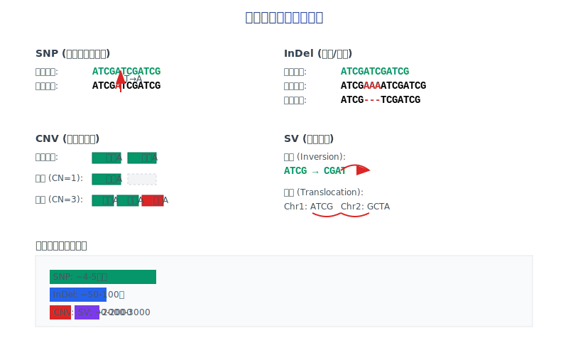
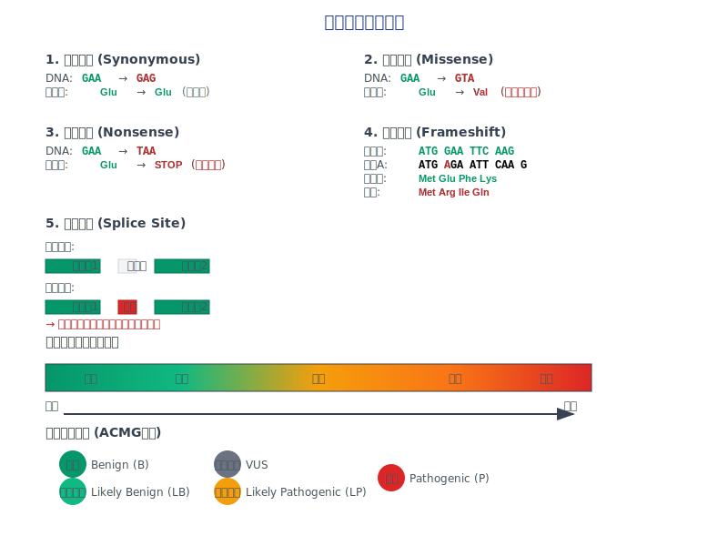
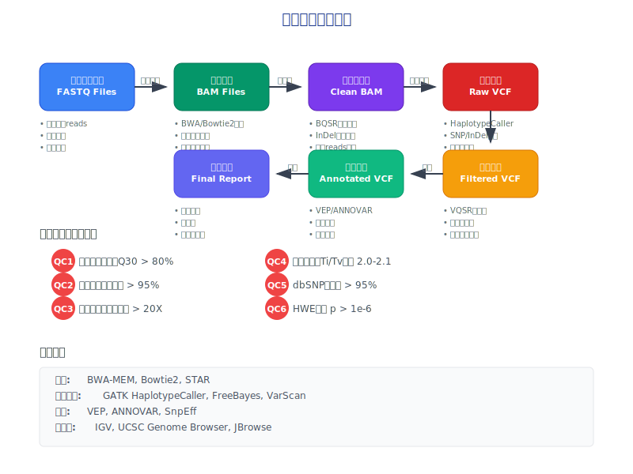
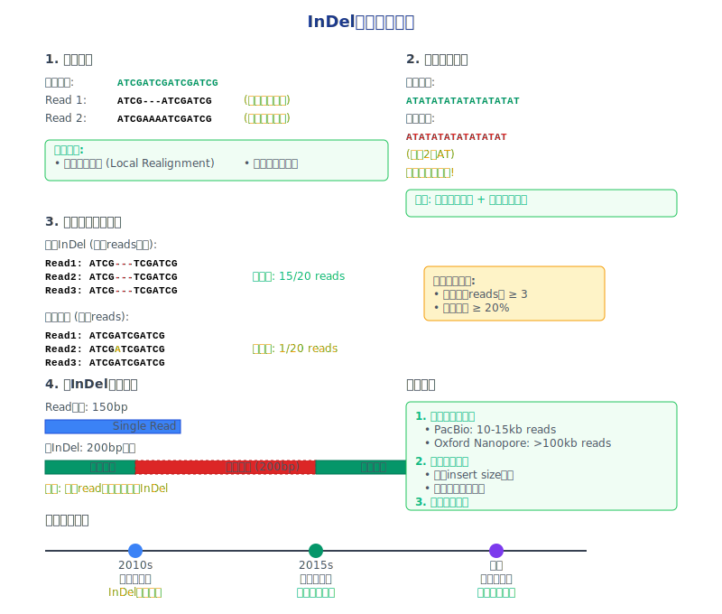
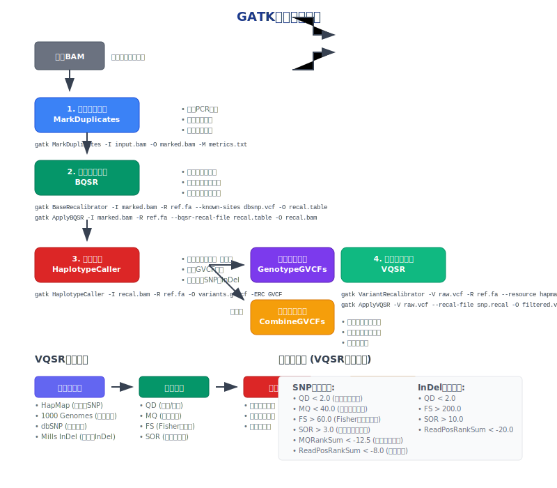
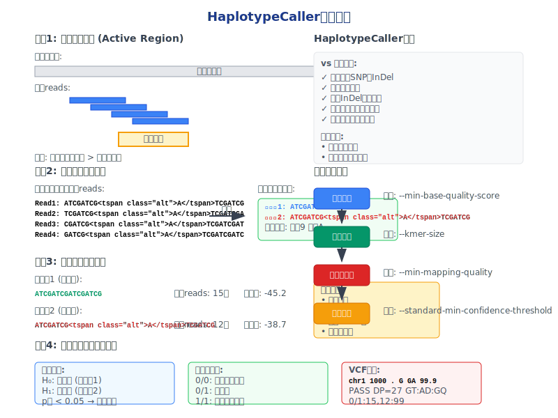
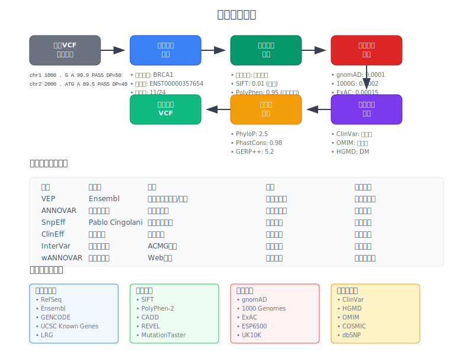
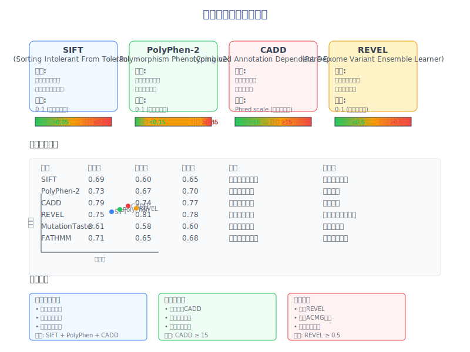
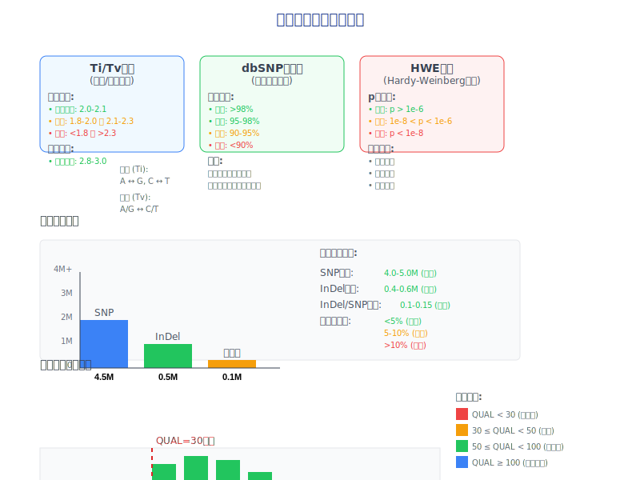

<!-- 
课程幻灯片模板
课程名称：高通量测序数据分析
主讲教师：王运生
联系邮箱：wangys@hunau.edu.cn
办公室：16教420室
上课地点：105机房
-->

<!-- _class: title -->
# 第4次课：变异检测与基因分型
## 高通量测序数据分析

**主讲教师：** 王运生  
**联系邮箱：** wangys@hunau.edu.cn  
**办公室：** 16教420室  
**上课地点：** 105机房  

---

<!-- _class: toc -->
# 本次课程内容

1. 变异类型与生物学意义
2. 变异检测原理与算法
3. GATK最佳实践流程
4. VCF格式与质量控制
5. 变异注释与功能预测
6. 实践操作演示

---

**学习目标：**
- 理解不同变异类型的检测原理
- 掌握GATK变异检测流程
- 学会VCF文件处理和质量评估
- 了解变异功能注释方法

---

<!-- _class: content -->
# 1. 变异类型概述

## 什么是基因组变异？

基因组变异是指个体间DNA序列的差异，是生物多样性和疾病易感性的重要基础。

**主要变异类型：**
- **SNP (Single Nucleotide Polymorphism)**：单核苷酸多态性
- **InDel (Insertion/Deletion)**：插入/缺失变异
- **CNV (Copy Number Variation)**：拷贝数变异
- **SV (Structural Variation)**：结构变异

---



---

<!-- _class: multi-column -->
# 变异类型详细分类

<div class="columns">
<div class="column">

## 小变异
- **SNP**：单个碱基替换
  - 转换：A↔G, C↔T
  - 颠换：A/G↔C/T
- **InDel**：1-50bp插入缺失
  - 移码突变
  - 同框变异

</div>

---

<div class="column">

## 大变异
- **CNV**：>1kb拷贝数变异
  - 缺失（deletion）
  - 重复（duplication）
- **SV**：结构重排
  - 倒位（inversion）
  - 易位（translocation）

</div>
</div>

---

<!-- _class: content -->
# 变异的生物学意义

## 功能影响分类

**根据对蛋白质功能的影响：**

1. **同义变异**：不改变氨基酸序列
2. **错义变异**：改变氨基酸序列
3. **无义变异**：产生终止密码子
4. **移码变异**：改变阅读框
5. **剪接变异**：影响RNA剪接

---



---

<!-- _class: content -->
# 变异频率与分布

## 人类基因组变异统计

**典型个体基因组变异数量：**
- SNP：~4-5百万个
- 小InDel：~50-100万个
- CNV：~1000-2000个
- SV：~2000-3000个

---

**变异分布特点：**
- 编码区变异密度较低
- 非编码区变异更为常见
- 重复序列区域变异率高

---

<!-- _class: content -->
# 2. 变异检测原理

## 基本检测策略

**比对后变异检测流程：**

1. **序列比对**：将reads比对到参考基因组
2. **变异候选**：识别与参考序列不同的位点
3. **统计检验**：评估变异的可信度
4. **质量过滤**：去除低质量的假阳性变异

---



---

<!-- _class: content -->
# SNP检测原理

## 统计学基础

**基本假设：**
- H₀：该位点无变异（与参考基因组一致）
- H₁：该位点存在变异

**检测指标：**
- **覆盖深度**：该位点的reads数量
- **变异支持度**：支持变异的reads比例
- **碱基质量**：测序质量分数
- **比对质量**：reads比对的可信度

---

<!-- _class: code -->
# 变异检测算法示例

## 简单的SNP检测逻辑

```python
def detect_snp(position, reads, ref_base, min_depth=10, min_freq=0.3):
    """
    简单的SNP检测算法
    """
    # 统计各碱基的支持reads数
    base_counts = {'A': 0, 'T': 0, 'G': 0, 'C': 0}
    total_depth = 0
    
    for read in reads:
        if position in read.positions:
            base = read.get_base(position)
            if base in base_counts:
                base_counts[base] += 1
                total_depth += 1
    
    # 检查覆盖深度
    if total_depth < min_depth:
        return None
    
    # 找到最高频率的非参考碱基
    alt_bases = {base: count for base, count in base_counts.items() 
                 if base != ref_base and count > 0}
    
    if not alt_bases:
        return None
    
    # 计算变异频率
    max_alt_base = max(alt_bases, key=alt_bases.get)
    alt_freq = alt_bases[max_alt_base] / total_depth
    
    if alt_freq >= min_freq:
        return {
            'position': position,
            'ref': ref_base,
            'alt': max_alt_base,
            'depth': total_depth,
            'alt_count': alt_bases[max_alt_base],
            'frequency': alt_freq
        }
    
    return None
```

---

<!-- _class: content -->
# InDel检测挑战

## 技术难点

**主要挑战：**
1. **比对困难**：InDel区域比对复杂
2. **假阳性**：测序错误和比对错误
3. **重复序列**：同源序列干扰
4. **长InDel**：超出reads长度的InDel

**解决策略：**
- 局部重新比对（local realignment）
- 多种比对算法结合
- 基于图结构的比对方法

---



---

<!-- _class: content -->
# 3. GATK最佳实践

## GATK简介

**Genome Analysis Toolkit (GATK)**
- Broad Institute开发的变异检测工具包
- 业界标准的变异检测流程
- 持续更新和优化的算法

**核心组件：**
- HaplotypeCaller：变异检测
- GenotypeGVCFs：基因型确定
- VariantRecalibrator：质量校正

---

<!-- _class: content -->
# GATK最佳实践流程

## 完整分析流程

**数据预处理：**
1. 比对质量校正（BQSR）
2. 重复序列标记
3. InDel区域重新比对

---

**变异检测：**
1. HaplotypeCaller检测变异
2. 生成GVCF文件
3. 联合基因分型

**质量控制：**
1. 变异质量分数校正（VQSR）
2. 硬过滤（Hard filtering）

---



---

<!-- _class: code -->
# GATK核心命令

## 主要分析步骤

```bash
# 1. 碱基质量分数校正
gatk BaseRecalibrator \
    -I input.bam \
    -R reference.fasta \
    --known-sites dbsnp.vcf \
    -O recal_data.table

gatk ApplyBQSR \
    -I input.bam \
    -R reference.fasta \
    --bqsr-recal-file recal_data.table \
    -O output.recal.bam

# 2. 变异检测
gatk HaplotypeCaller \
    -I input.recal.bam \
    -R reference.fasta \
    -O variants.g.vcf \
    -ERC GVCF

# 3. 基因分型
gatk GenotypeGVCFs \
    -R reference.fasta \
    -V variants.g.vcf \
    -O variants.vcf
```

---

<!-- _class: content -->
# HaplotypeCaller算法

## 核心特点

**算法优势：**
- 基于单倍型的变异检测
- 同时检测SNP和InDel
- 局部重新组装
- 减少假阳性变异

---

**工作原理：**
1. 识别活跃区域（Active Region）
2. 局部序列重新组装
3. 单倍型比对和评分
4. 变异候选生成

---



---

<!-- _class: content -->
# 4. VCF格式详解

## VCF文件结构

**Variant Call Format (VCF)**
- 变异检测结果的标准格式
- 包含变异位置、类型、质量信息
- 支持多样本数据

**文件组成：**
- **头部信息**：元数据和格式定义
- **数据行**：每行一个变异位点
- **必需字段**：CHROM, POS, ID, REF, ALT, QUAL, FILTER, INFO
- **可选字段**：FORMAT, 样本基因型

---

<!-- _class: code -->
# VCF格式示例

```vcf
##fileformat=VCFv4.2
##reference=hg38
##INFO=<ID=DP,Number=1,Type=Integer,Description="Total Depth">
##INFO=<ID=AF,Number=A,Type=Float,Description="Allele Frequency">
##FORMAT=<ID=GT,Number=1,Type=String,Description="Genotype">
##FORMAT=<ID=DP,Number=1,Type=Integer,Description="Read Depth">
##FORMAT=<ID=AD,Number=R,Type=Integer,Description="Allelic depths">
#CHROM	POS	ID	REF	ALT	QUAL	FILTER	INFO	FORMAT	SAMPLE1
chr1	1000	rs123	A	G	99.9	PASS	DP=50;AF=0.5	GT:DP:AD	0/1:50:25,25
chr1	2000	.	ATG	A	89.5	PASS	DP=40;AF=0.75	GT:DP:AD	1/1:40:10,30
chr2	3000	rs456	C	T,G	95.2	PASS	DP=60;AF=0.3,0.2	GT:DP:AD	1/2:60:30,18,12
```

**字段解释：**
- GT: 基因型 (0/1表示杂合子)
- DP: 覆盖深度
- AD: 各等位基因支持reads数
- AF: 等位基因频率

---

<!-- _class: content -->
# VCF质量指标

## 重要质量参数

**变异级别质量：**
- **QUAL**：变异质量分数（Phred scale）
- **DP**：总覆盖深度
- **MQ**：比对质量均值
- **QD**：质量/深度比值

---

**基因型级别质量：**
- **GQ**：基因型质量
- **PL**：基因型似然值
- **AD**：等位基因深度

**过滤标准：**
- QUAL > 30 (99.9%准确性)
- DP > 10 (足够覆盖深度)
- QD > 2.0 (质量密度)

---

<!-- _class: multi-column -->
# 变异质量评估

<div class="columns">
<div class="column">

## 硬过滤标准
- **SNP过滤**：
  - QD < 2.0
  - MQ < 40.0
  - FS > 60.0
  - SOR > 3.0
  - ReadPosRankSum < -8.0

</div>

---

<div class="column">

## VQSR软过滤
- **机器学习方法**
- **训练数据集**：
  - HapMap
  - 1000 Genomes
  - dbSNP
- **特征参数**：
  - QD, MQ, FS, SOR等

</div>
</div>

---

<!-- _class: content -->
# 5. 变异注释

## 注释的重要性

**为什么需要注释？**
- 理解变异的生物学意义
- 预测功能影响
- 优先级排序
- 临床解读

---

**注释内容：**
- 基因位置信息
- 功能预测
- 保守性评分
- 人群频率
- 疾病关联

---



---

<!-- _class: content -->
# 主要注释工具

## 常用注释软件

**VEP (Variant Effect Predictor)**
- Ensembl开发
- 功能全面
- 在线和本地版本

---

**ANNOVAR**
- 王凯教授开发
- 注释数据库丰富
- 命令行友好

**SnpEff**
- 轻量级工具
- 快速注释
- 统计报告

---

<!-- _class: code -->
# 变异注释示例

## VEP注释命令

```bash
# 使用VEP进行变异注释
vep --input_file variants.vcf \
    --output_file annotated_variants.txt \
    --format vcf \
    --species homo_sapiens \
    --assembly GRCh38 \
    --cache \
    --offline \
    --everything \
    --force_overwrite

# 主要注释字段
# Consequence: 变异后果类型
# SYMBOL: 基因名称
# Feature: 转录本ID
# SIFT: 功能预测分数
# PolyPhen: 功能预测分数
# gnomAD_AF: 人群频率
```

## ANNOVAR注释

```bash
# 格式转换
convert2annovar.pl -format vcf4 variants.vcf > variants.avinput

# 基因注释
annotate_variation.pl -geneanno -dbtype refGene \
    variants.avinput humandb/

# 功能预测
annotate_variation.pl -filter -dbtype ljb26_all \
    variants.avinput humandb/
```

---

<!-- _class: content -->
# 变异功能预测

## 预测算法

**有害性预测工具：**
- **SIFT**：基于进化保守性
- **PolyPhen-2**：结构和进化信息
- **CADD**：综合评分系统
- **REVEL**：集成多种预测器

---

**评分解读：**
- SIFT < 0.05：有害
- PolyPhen > 0.5：可能有害
- CADD > 15：前1%有害变异
- REVEL > 0.5：致病性

---



---

<!-- _class: content -->
# 人群频率数据库

## 重要数据库

**gnomAD (Genome Aggregation Database)**
- 最大的人群变异频率数据库
- 包含>140,000个外显子组
- 提供不同人群的频率信息

---

**其他重要数据库：**
- **1000 Genomes**：26个人群
- **ExAC**：gnomAD前身
- **ESP6500**：欧洲裔和非洲裔
- **ClinVar**：临床意义变异

**频率过滤原则：**
- 常见变异：MAF > 1%
- 罕见变异：MAF < 0.1%
- 超罕见变异：MAF < 0.01%

---

<!-- _class: content -->
# 6. 质量控制策略

## 多层次质量控制

**测序数据质量：**
- 原始数据质量评估
- 比对质量检查
- 覆盖深度分析

---

**变异检测质量：**
- Ti/Tv比值检查
- InDel/SNP比值
- 新变异比例

**注释质量：**
- 功能分布检查
- 频率分布验证
- 已知变异比例

---



---

<!-- _class: multi-column -->
# 质量控制指标

<div class="columns">
<div class="column">

## SNP质量指标
- **Ti/Tv比值**：2.0-2.1
- **dbSNP重叠率**：>95%
- **HWE p值**：>1e-6
- **缺失率**：<5%

</div>

---

<div class="column">

## InDel质量指标
- **InDel/SNP比值**：0.2-0.25
- **移码/同框比值**：1:2
- **重复区域比例**：<30%
- **长度分布**：1-3bp占主导

</div>
</div>

---

<!-- _class: content -->
# 批次效应检测

## 技术重复性评估

**主成分分析（PCA）**
- 检测样本聚类模式
- 识别批次效应
- 发现异常样本

---

**相关性分析**
- 样本间变异一致性
- 技术重复相关性
- 生物学重复验证

**解决策略**
- 批次校正算法
- 重新处理异常样本
- 统计模型调整

---

<!-- _class: content -->
# 7. 实际应用案例

## 疾病关联研究

**全基因组关联研究（GWAS）**
- 大规模人群变异检测
- 疾病易感位点发现
- 药物反应预测

---

**罕见病诊断**
- 外显子组测序
- 致病变异筛选
- 功能验证实验

**肿瘤基因组学**
- 体细胞变异检测
- 驱动基因识别
- 治疗靶点发现

---

<!-- _class: content -->
# 个性化医疗应用

## 精准医疗实践

**药物基因组学**
- CYP2D6变异与药物代谢
- BRCA1/2与乳腺癌风险
- CFTR与囊性纤维化

---

**治疗方案选择**
- 靶向治疗药物选择
- 化疗敏感性预测
- 免疫治疗反应预测

**风险评估**
- 多基因风险评分
- 疾病易感性评估
- 预防策略制定

---

<!-- _class: content -->
# 8. 技术发展趋势

## 新技术挑战

**长读长测序**
- PacBio和Oxford Nanopore
- 结构变异检测优势
- 重复序列区域解析

---

**单细胞测序**
- 细胞异质性检测
- 体细胞变异谱系追踪
- 发育过程变异积累

**多组学整合**
- 基因组+转录组+表观组
- 变异功能影响评估
- 系统生物学分析

---

<!-- _class: content -->
# 计算挑战与解决方案

## 大数据处理

**数据规模挑战**
- TB级别数据存储
- 计算资源需求
- 分析时间优化

---

**解决策略**
- 云计算平台
- 并行计算框架
- 算法优化改进

**标准化需求**
- 数据格式统一
- 分析流程标准化
- 质量控制规范

---

<!-- _class: summary -->
# 本次课程总结

## 主要内容回顾
- 变异类型与检测原理：SNP、InDel、CNV、SV
- GATK最佳实践流程：预处理、检测、质量控制
- VCF格式与质量评估：标准格式、质量指标
- 变异注释与功能预测：生物学意义、临床应用

---

## 下次课程预告
- **主题**：转录组测序数据分析
- **内容**：RNA-seq原理、差异表达分析、功能富集
- **准备**：复习分子生物学中心法则

**作业/练习：**
- 完成GATK变异检测实验
- 分析提供的VCF文件质量指标
- 思考：如何区分真实变异和技术假象？

---

<!-- _class: end -->
# 谢谢大家！

**有问题请联系：**
- 邮箱：wangys@hunau.edu.cn
- 办公室：16教420室
