<!-- 
第5次课：转录组测序数据分析
课程名称：高通量测序数据分析
主讲教师：王运生
联系邮箱：wangys@hunau.edu.cn
办公室：16教420室
上课地点：105机房
-->

<!-- _class: title -->
# 第5次课：转录组测序数据分析
## 高通量测序数据分析

**主讲教师：** 王运生  
**联系邮箱：** wangys@hunau.edu.cn  
**办公室：** 16教420室  
**上课地点：** 105机房  

---

<!-- _class: toc -->
# 本次课程内容

1. **转录组测序技术概述**
3. **转录组数据预处理**
4. **序列比对与基因定量**
5. **差异表达分析方法**
6. **其他分析**

---

# 学习目标
- 掌握RNA-seq实验设计原理和关键考虑因素
- 理解转录组数据分析的完整流程
- 学会使用主流工具进行差异表达分析

---

<!-- _class: content -->
# 转录组测序技术发展

## 技术演进历程

- **第一代技术**：Sanger测序 - 单个基因克隆测序
- **第二代技术**：芯片技术 - 预设探针检测
- **第三代技术**：RNA-seq - 全转录组无偏检测
- **第四代技术**：单细胞RNA-seq - 细胞异质性分析

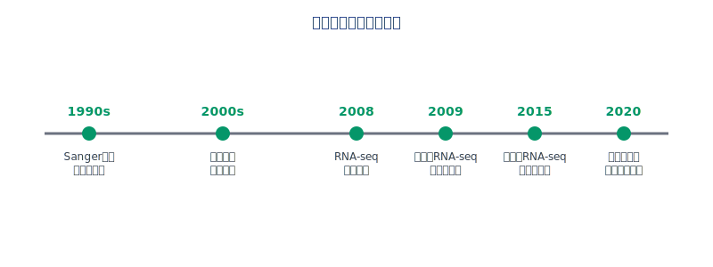

---

<!-- _class: multi-column -->
# RNA-seq vs 传统方法

| 特征 | 传统芯片技术 | RNA-seq技术 |
|------|------------|-------------|
| **检测范围** | 只能检测已知序列 | 全转录组覆盖 |
| **动态范围** | 有限 | 广泛 |
| **新转录本发现** | 无法发现 | 可发现新转录本 |
| **剪接变异检测** | 不支持 | 可检测剪接变异 |
| **成本** | 相对较低 | 较高 |
| **标准化程度** | 高 | 中等 |
| **分析流程** | 成熟 | 复杂 |
| **数据量** | 小 | 大 |

---

<!-- _class: content -->
# RNA-seq技术原理

## 基本流程

1. **RNA提取**：从样本中提取总RNA
2. **mRNA富集**：去除rRNA，富集mRNA
3. **反转录**：mRNA反转录为cDNA
4. **文库构建**：添加接头，PCR扩增
5. **测序**：高通量测序获得reads
6. **数据分析**：比对、定量、差异分析

---

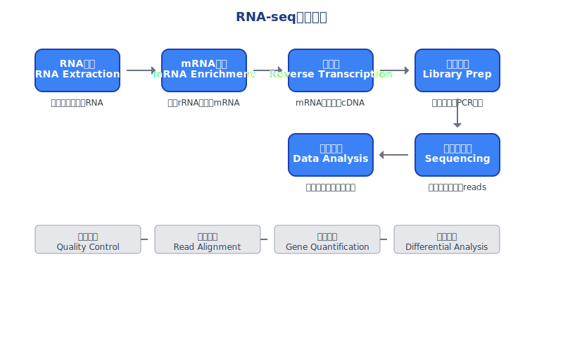

---

<!-- _class: content -->
# RNA-seq实验设计考虑因素

## 样本设计

<div class="columns">
<div class="column">

### 生物学重复
- **最少3个生物学重复**
- 技术重复通常不必要
- 重复数量影响统计检验力

</div>
<div class="column">

### 样本收集
- **时间点选择**：考虑生物学过程时间尺度
- **样本保存**：液氮冷冻或RNA保护剂
- **批次效应**：随机化样本处理顺序

</div>
</div>

---

<!-- _class: multi-column -->
# 测序深度与覆盖度

<div class="columns">
<div class="column">

## 测序深度建议
- **人类全转录组**：20-30M reads
- **模式生物**：15-25M reads  
- **非模式生物**：30-50M reads
- **单细胞RNA-seq**：1-10M reads

</div>
<div class="column">

## 影响因素
- **转录组复杂度**
- **检测目标**（高/低表达基因）
- **差异倍数要求**
- **统计检验力需求**
- **预算限制**

</div>
</div>

---

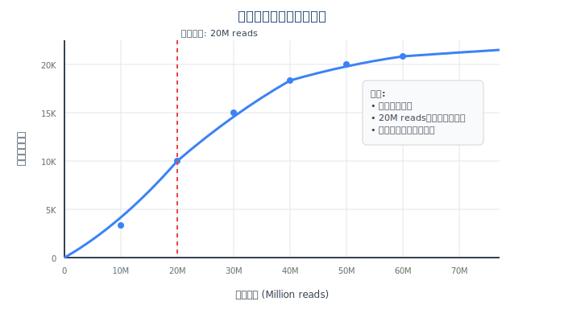

---

<!-- _class: content -->
# 链特异性测序

## 技术原理

<div class="columns">
<div class="column">

### 非链特异性测序
- 无法区分正义链和反义链
- 反义转录本可能被误判
- 基因重叠区域定量不准确

</div>
<div class="column">

### 链特异性测序
- 保留原始链信息
- 准确定量反义转录本
- 提高基因注释准确性

</div>
</div>

---

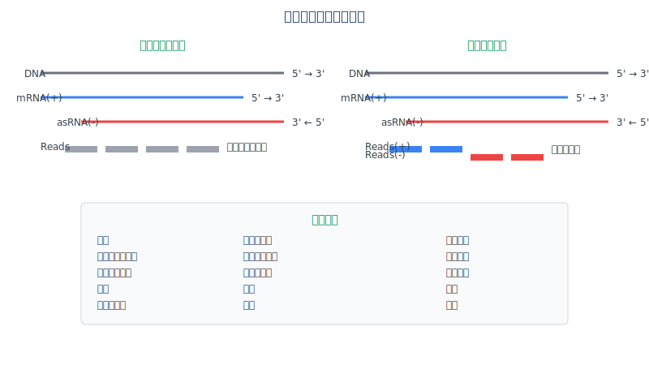

---

<!-- _class: content -->
# 转录组数据预处理

## 质量控制流程

1. **原始数据质量评估**
   - FastQC质量报告
   - 序列质量分布
   - GC含量分析
   - 重复序列检测

---

2. **数据清洗**
   - 接头序列去除
   - 低质量碱基修剪
   - 短序列过滤

3. **污染检测**
   - rRNA污染检查
   - 基因组DNA污染
   - 其他物种污染

---

<!-- _class: code -->
# 数据预处理命令示例

## FastQC质量评估
```bash
# 批量质量评估
fastqc *.fastq.gz -o qc_reports/

# 生成汇总报告
multiqc qc_reports/ -o multiqc_report/
```

---

## Trimmomatic数据清洗
```bash
# 双端测序数据清洗
trimmomatic PE -threads 8 \
  sample_R1.fastq.gz sample_R2.fastq.gz \
  sample_R1_clean.fastq.gz sample_R1_unpaired.fastq.gz \
  sample_R2_clean.fastq.gz sample_R2_unpaired.fastq.gz \
  ILLUMINACLIP:adapters.fa:2:30:10 \
  LEADING:3 TRAILING:3 SLIDINGWINDOW:4:15 MINLEN:36
```

---

<!-- _class: content -->
# 序列比对策略

## 比对工具选择

### 剪接感知比对器
- **HISAT2**：快速、内存效率高
- **STAR**：精确、适合大基因组
- **TopHat2**：经典工具（已不推荐）

---

### 比对参数优化
- **最大错配数**：通常允许2-3个错配
- **剪接位点**：使用已知注释或从头预测
- **多重比对**：处理重复序列区域

---

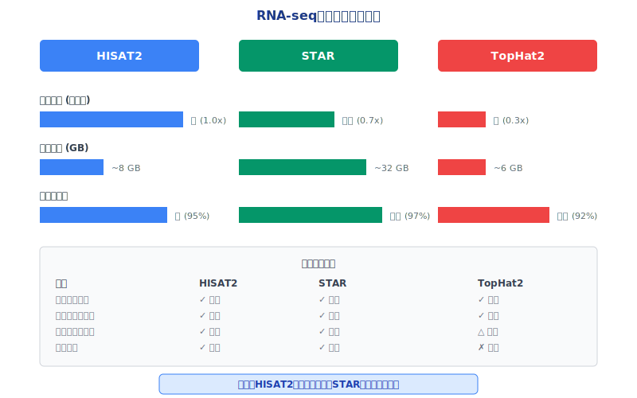

---

<!-- _class: code -->
# HISAT2比对流程

## 建立索引
```bash
# 下载参考基因组和注释
wget ftp://ftp.ensembl.org/pub/release-104/fasta/homo_sapiens/dna/Homo_sapiens.GRCh38.dna.primary_assembly.fa.gz
wget ftp://ftp.ensembl.org/pub/release-104/gtf/homo_sapiens/Homo_sapiens.GRCh38.104.gtf.gz

# 建立HISAT2索引
hisat2-build Homo_sapiens.GRCh38.dna.primary_assembly.fa genome_index
```

---

## 序列比对
```bash
# 双端测序比对
hisat2 -x genome_index \
  -1 sample_R1_clean.fastq.gz \
  -2 sample_R2_clean.fastq.gz \
  -S sample.sam \
  --threads 8 \
  --rna-strandness RF
```

---

<!-- _class: content -->
# 基因表达定量方法

## 定量策略分类

<div class="columns">
<div class="column">

### 基于比对的方法
- **HTSeq-count**：经典计数工具
- **featureCounts**：快速、准确
- **RSEM**：处理多重比对

</div>
<div class="column">

### 无比对方法
- **Salmon**：快速伪比对
- **Kallisto**：k-mer匹配
- **Sailfish**：Salmon前身

</div>
</div>

---

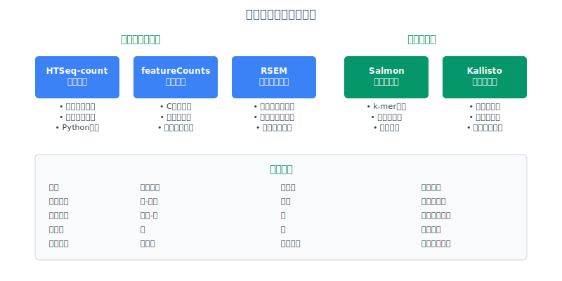

---

<!-- _class: multi-column -->
# 表达量标准化

<div class="columns">
<div class="column">

## 标准化方法
- **CPM**：Counts Per Million
- **RPKM/FPKM**：考虑基因长度
- **TPM**：Transcripts Per Million
- **TMM**：Trimmed Mean of M-values

</div>
<div class="column">

## 选择原则
- **样本内比较**：RPKM/FPKM/TPM
- **样本间比较**：TMM/RLE
- **差异分析**：使用原始counts
- **功能分析**：TPM推荐

</div>
</div>

---

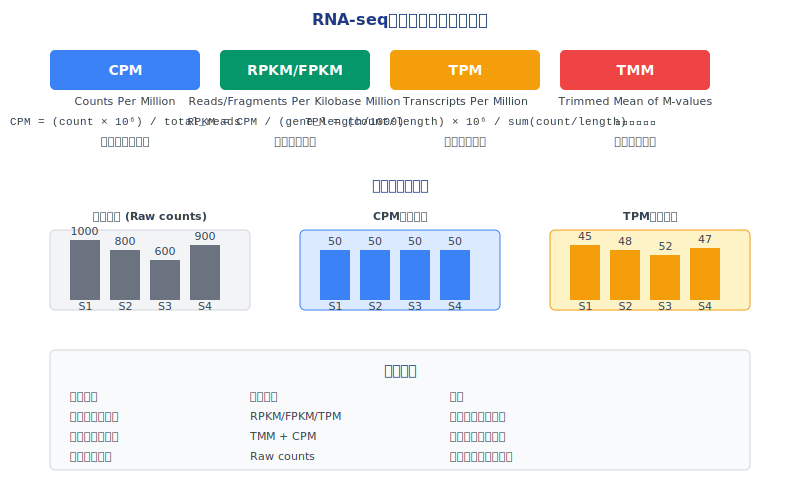

---

<!-- _class: code -->
# featureCounts基因定量

<div class="columns">
<div class="column">

## 基本用法
```bash
# 从SAM/BAM文件计数
featureCounts -a annotation.gtf \
  -o gene_counts.txt \
  -T 8 \
  -p \
  -B \
  -C \
  sample1.bam sample2.bam sample3.bam
```

</div>
<div class="column">

## 参数说明
- `-a`：基因注释文件（GTF/GFF格式）
- `-o`：输出文件名
- `-T`：线程数
- `-p`：双端测序模式
- `-B`：只计算正确配对的reads
- `-C`：不计算嵌合reads

</div>
</div>

---

<!-- _class: content -->
# 差异表达分析原理

## 统计学基础

<div class="columns">
<div class="column">

### 负二项分布模型
- RNA-seq数据符合负二项分布
- 考虑生物学变异和技术变异
- 处理过度离散问题

</div>
<div class="column">

### 假设检验
- **零假设**：基因在两组间无差异表达
- **备择假设**：基因存在差异表达
- **检验统计量**：Wald检验、似然比检验

</div>
</div>

---

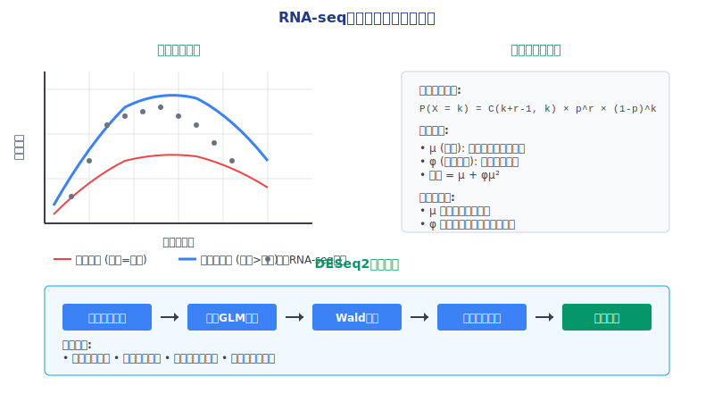

---

<!-- _class: multi-column -->
# 主流差异分析工具

| 工具 | 优点 | 适用场景 |
|------|------|----------|
| **DESeq2** | 统计方法严谨<br>处理批次效应<br>可视化功能强 | 样本数较少 |
| **edgeR** | 计算速度快<br>灵活的模型设计<br>多种标准化方法 | 大样本分析 |

### limma-voom
- **特点**：线性模型框架，处理复杂实验设计
- **优势**：成熟的统计方法，丰富的下游分析

---

<!-- _class: code -->
# DESeq2差异分析流程

## R代码示例
```r
# 加载必要的包
library(DESeq2)
library(ggplot2)

# 读取计数矩阵和样本信息
countData <- read.table("gene_counts.txt", header=TRUE, row.names=1)
colData <- read.table("sample_info.txt", header=TRUE, row.names=1)

# 创建DESeq2对象
dds <- DESeqDataSetFromMatrix(countData = countData,
                              colData = colData,
                              design = ~ condition)

# 过滤低表达基因
keep <- rowSums(counts(dds)) >= 10
dds <- dds[keep,]

# 运行差异分析
dds <- DESeq(dds)
res <- results(dds)
```

---

<!-- _class: content -->
# 多重检验校正

<div class="columns">
<div class="column">

## 问题描述
- 同时检验数万个基因
- 假阳性率急剧增加
- 需要调整显著性阈值

## 校正方法
- **Bonferroni校正**：过于保守
- **FDR控制**：Benjamini-Hochberg方法
- **q-value**：考虑检验统计量分布

</div>
<div class="column">

### 阈值设定
- **|log2FC| > 1**：表达倍数大于2倍
- **padj < 0.05**：校正后p值小于0.05

</div>
</div>

---

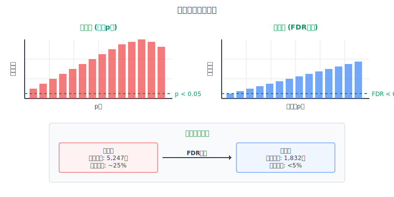

---

<!-- _class: content -->
# 结果可视化

## 主要图表类型

<div class="columns">
<div class="column">

### MA图（M-A plot）
- **M轴**：log2倍数变化
- **A轴**：平均表达量
- 显示差异基因分布

### 火山图（Volcano plot）
- **X轴**：log2倍数变化
- **Y轴**：-log10(p值)
- 同时显示显著性和倍数变化

</div>
<div class="column">

### 热图（Heatmap）
- 显示差异基因表达模式
- 样本聚类分析
- 基因功能聚类

</div>
</div>

---

<!-- _class: image -->
# 差异表达分析结果可视化

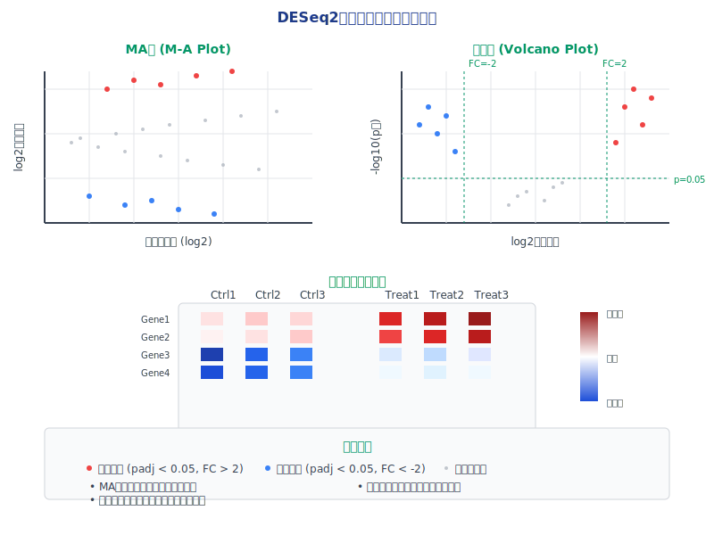

---

<!-- _class: code -->
# 结果可视化代码

## 生成MA图和火山图
```r
# MA图
plotMA(res, main="MA Plot", ylim=c(-2,2))

# 火山图
library(EnhancedVolcano)
EnhancedVolcano(res,
    lab = rownames(res),
    x = 'log2FoldChange',
    y = 'pvalue',
    title = 'Volcano Plot',
    pCutoff = 0.05,
    FCcutoff = 1.0)

# 热图
library(pheatmap)
select <- order(rowMeans(counts(dds,normalized=TRUE)),
                decreasing=TRUE)[1:20]
df <- as.data.frame(colData(dds)[,c("condition")])
pheatmap(assay(vsd)[select,], cluster_rows=FALSE, 
         show_rownames=FALSE, cluster_cols=FALSE, 
         annotation_col=df)
```

---

<!-- _class: content -->
# 功能富集分析

<div class="columns">
<div class="column">

## 分析目的
- 理解差异基因的生物学意义
- 识别受影响的生物学通路
- 发现潜在的调控机制

## 主要数据库
- **GO**：Gene Ontology - 基因功能注释
- **KEGG**：代谢通路数据库
- **Reactome**：反应通路数据库
- **MSigDB**：分子标签数据库

</div>
<div class="column">

### 分析方法
- **过表征分析**：Fisher精确检验
- **基因集富集分析**：GSEA
- **通路拓扑分析**：考虑基因间关系

</div>
</div>

---

<!-- _class: multi-column -->
# GO功能分类

<div class="columns">
<div class="column">

## 三大类别
- **BP**：Biological Process
  - 生物学过程
  - 如细胞分裂、凋亡
- **MF**：Molecular Function  
  - 分子功能
  - 如酶活性、结合活性
- **CC**：Cellular Component
  - 细胞组分
  - 如细胞核、线粒体

</div>
<div class="column">

## 层次结构
- **有向无环图**（DAG）
- 从通用到具体
- 子节点继承父节点注释
- 支持多重继承

</div>
</div>

---

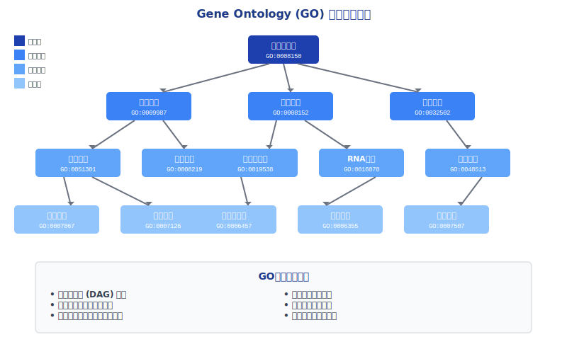

---

<!-- _class: code -->
# clusterProfiler富集分析

## GO富集分析
```r
library(clusterProfiler)
library(org.Hs.eg.db)

# 获取差异基因列表
deg_genes <- rownames(res[which(res$padj < 0.05 & abs(res$log2FoldChange) > 1),])

# GO富集分析
ego <- enrichGO(gene = deg_genes,
                OrgDb = org.Hs.eg.db,
                ont = "BP",
                pAdjustMethod = "BH",
                pvalueCutoff = 0.01,
                qvalueCutoff = 0.05,
                readable = TRUE)

# KEGG通路分析
kk <- enrichKEGG(gene = deg_genes,
                 organism = 'hsa',
                 pvalueCutoff = 0.05)
```

---

<!-- _class: content -->
# 高级分析方法

<div class="columns">
<div class="column">

## 时间序列分析
- **目标**：研究基因表达的时间动态
- **方法**：样条回归、聚类分析
- **工具**：maSigPro、STEM

## 共表达网络分析
- **目标**：识别共调控基因模块
- **方法**：WGCNA、相关性分析
- **应用**：关键基因识别、功能预测

</div>
<div class="column">

## 剪接变异分析
- **目标**：检测差异剪接事件
- **工具**：rMATS、SUPPA、LeafCutter
- **意义**：蛋白质多样性、疾病机制

</div>
</div>

---

<!-- _class: content -->
# 单细胞RNA-seq简介

<div class="columns">
<div class="column">

## 技术特点
- **细胞异质性**：揭示细胞间差异
- **发育轨迹**：追踪细胞分化过程
- **稀有细胞类型**：发现新的细胞亚群

## 技术挑战
- **数据稀疏性**：大量零值
- **技术噪音**：扩增偏好性
- **批次效应**：实验间差异


</div>
<div class="column">

## 分析流程
1. 质量控制和过滤
2. 标准化和特征选择
3. 降维和聚类
4. 细胞类型注释
5. 轨迹分析

</div>
</div>

---

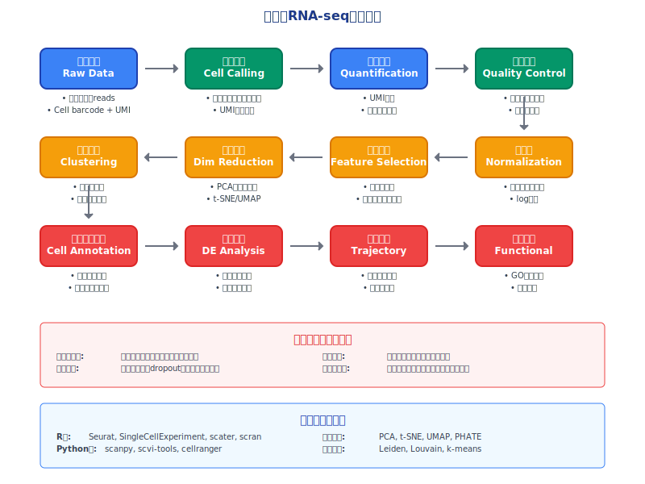

---

<!-- _class: content -->
# 转录组数据整合

<div class="columns">
<div class="column">

## 多样本整合
- **批次效应校正**：ComBat、limma
- **数据标准化**：跨样本一致性
- **质量控制**：异常样本识别

## 多组学整合
- **转录组 + 蛋白质组**：mRNA-蛋白相关性
- **转录组 + 代谢组**：代谢通路活性
- **转录组 + 表观组**：调控机制解析

</div>
<div class="column">

## 公共数据利用
- **GEO数据库**：表达数据仓库
- **TCGA**：癌症基因组图谱
- **GTEx**：正常组织表达图谱

</div>
</div>

---

<!-- _class: content -->
# 转录组分析工具生态

<div class="columns">
<div class="column">

## 命令行工具
- **质量控制**：FastQC, MultiQC
- **数据清洗**：Trimmomatic, Cutadapt
- **序列比对**：HISAT2, STAR
- **基因定量**：featureCounts, Salmon
- **差异分析**：DESeq2, edgeR

</div>
<div class="column">

## 集成平台
- **Galaxy**：Web界面分析平台
- **Bioconductor**：R语言生物信息包
- **Nextflow/Snakemake**：工作流管理
- **Docker/Singularity**：容器化部署

</div>
</div>

---

<!-- _class: content -->
# 云计算在转录组分析中的应用

<div class="columns">
<div class="column">

## 优势
- **计算资源弹性**：按需扩展
- **成本效益**：避免硬件投资
- **协作便利**：数据共享
- **工具预装**：减少配置工作

</div>
<div class="column">

## 主要平台
- **AWS**：EC2, S3, Batch
- **Google Cloud**：Compute Engine, Storage
- **阿里云**：ECS, OSS
- **华为云**：ECS, OBS

## 注意事项
- **数据安全**：加密传输和存储
- **成本控制**：监控资源使用
- **网络带宽**：大文件传输

</div>
</div>

---

<!-- _class: summary -->
# 本次课程总结

## 主要内容回顾
- **RNA-seq技术原理**：从实验设计到数据产生
- **数据预处理**：质量控制和序列清洗
- **序列比对与定量**：HISAT2和featureCounts
- **差异表达分析**：DESeq2统计方法
- **结果解读**：可视化和功能分析
- **高级应用**：单细胞、时间序列、网络分析

---

## 下次课程预告
- **ChIP-seq与表观基因组分析**
- 染色质免疫沉淀测序原理
- Peak calling和表观遗传修饰分析

## 作业/练习
- 完成转录组分析实践操作
- 分析提供的RNA-seq数据集
- 撰写分析报告

---

<!-- _class: end -->
# 谢谢大家！

**有问题请联系：**
- 邮箱：wangys@hunau.edu.cn
- 办公室：16教420室
