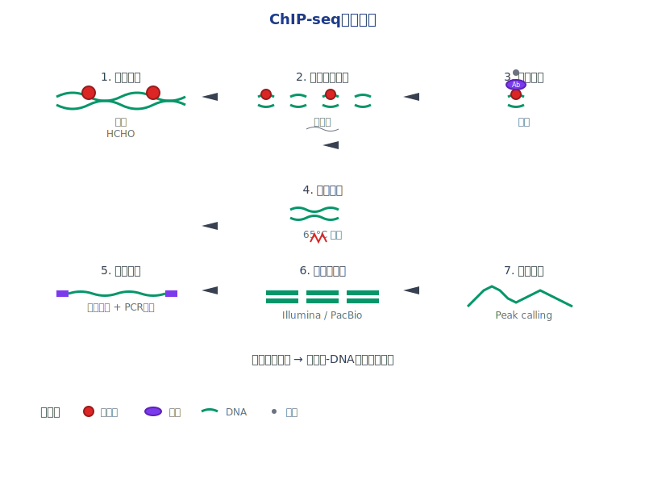
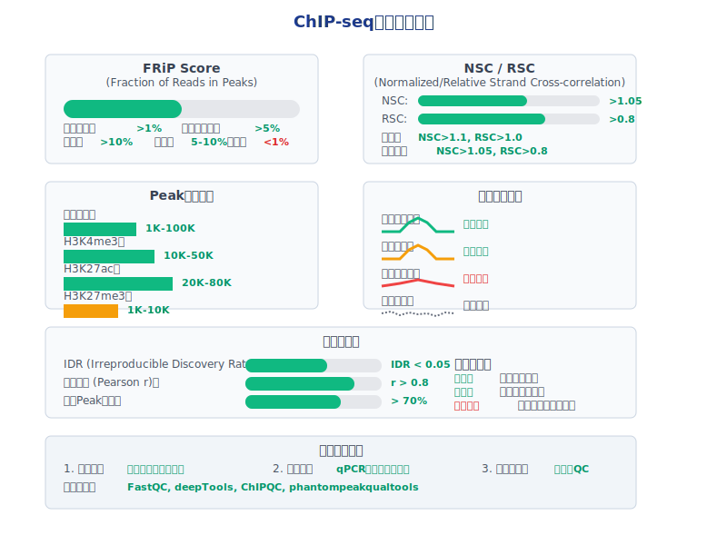
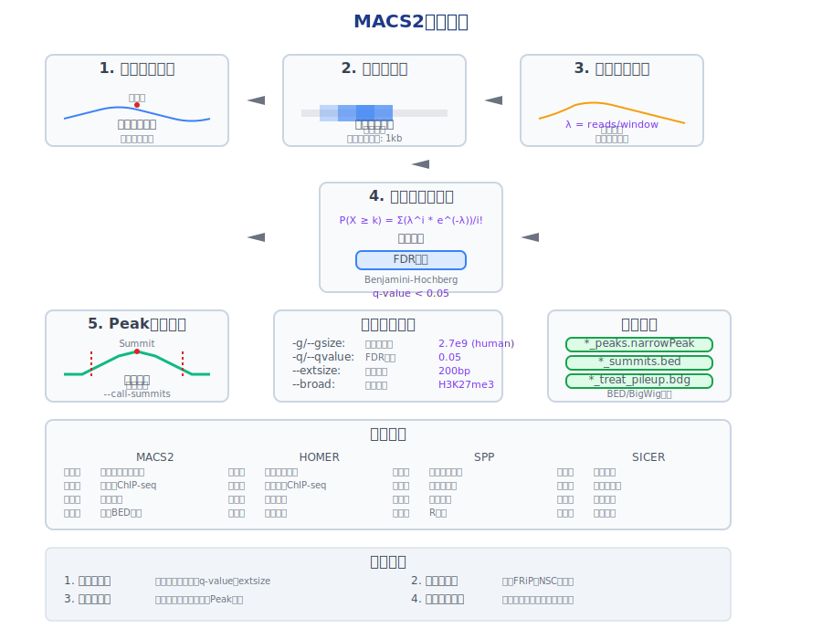
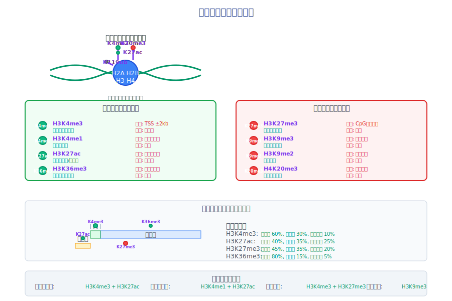
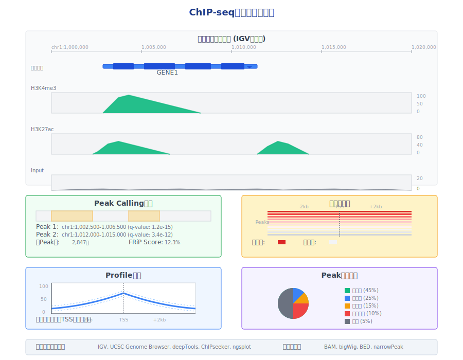

<!-- 
第6次课：ChIP-seq与表观基因组分析
课程名称：高通量测序数据分析
主讲教师：王运生
联系邮箱：wangys@hunau.edu.cn
办公室：16教420室
上课地点：105机房
-->

<!-- _class: title -->
# ChIP-seq与表观基因组分析
## 高通量测序数据分析 - 第6次课

**主讲教师：** 王运生  
**联系邮箱：** wangys@hunau.edu.cn  
**办公室：** 16教420室  
**上课地点：** 105机房  

---

<!-- _class: toc -->
# 本次课程内容

1. ChIP-seq技术原理与发展
2. 实验设计与质量控制
3. 数据预处理与比对
4. Peak calling算法与工具
5. 表观遗传修饰分析
6. 结果可视化与功能注释

---

# 学习目标
- 理解ChIP-seq技术原理和实验流程
- 掌握MACS2等Peak calling工具的使用
- 学会ChIP-seq数据质量控制方法
- 了解表观基因组学分析策略

---

<!-- _class: content -->
# ChIP-seq技术简介

## 什么是ChIP-seq？

**ChIP-seq** = **Ch**romatin **I**mmuno**p**recipitation + **seq**uencing

- 结合染色质免疫共沉淀和高通量测序技术
- 用于研究蛋白质-DNA相互作用
- 可以检测转录因子结合位点、组蛋白修饰等
- 在全基因组范围内提供高分辨率的结合图谱

---



---

<!-- _class: content -->
# ChIP-seq技术发展历程

<div class="columns">
<div class="column">

## 技术演进

- **1984年**: ChIP技术诞生（Solomon & Varshavsky）
- **2000年**: ChIP-chip技术（结合芯片技术）
- **2007年**: ChIP-seq技术问世（Johnson et al., Science）
- **2010年**: 标准化流程建立（ENCODE项目）
- **2015年**: 单细胞ChIP-seq技术
- **2020年**: CUT&Tag等新技术涌现

</div>
<div class="column">

## 技术优势
- 全基因组覆盖
- 高分辨率（~200bp）
- 定量分析能力
- 成本效益好

</div>
</div>

---

<!-- _class: multi-column -->
# ChIP-seq vs 其他技术

<div class="columns">
<div class="column">

## ChIP-seq优势
- **覆盖范围广**：全基因组
- **分辨率高**：单核苷酸水平
- **定量准确**：reads数量反映结合强度
- **成本合理**：相比ChIP-chip更经济
- **灵活性强**：可检测任何蛋白质

</div>
<div class="column">

## 技术局限性
- **抗体依赖**：需要高质量特异性抗体
- **细胞数量要求**：传统方法需要大量细胞
- **交联偏好**：某些蛋白质难以交联
- **分辨率限制**：受DNA片段化影响
- **假阳性**：非特异性结合

</div>
</div>

---

<!-- _class: content -->
# ChIP-seq实验原理

## 基本实验流程

1. **细胞固定**：甲醛交联蛋白质-DNA复合物
2. **染色质片段化**：超声波或酶切断DNA
3. **免疫沉淀**：特异性抗体捕获目标蛋白
4. **交联逆转**：释放DNA片段
5. **文库构建**：添加接头，PCR扩增
6. **高通量测序**：获得DNA序列信息

---


---

<!-- _class: content -->
# 实验设计要点

## 关键设计考虑

<div class="columns">
<div class="column">

### 1. 抗体选择
- **特异性验证**：Western blot, IP-MS
- **ChIP验证**：已知阳性位点qPCR
- **批次一致性**：同一批次抗体
- **浓度优化**：滴定实验确定最佳用量

</div>
<div class="column">

### 2. 对照设计
- **Input对照**：未免疫沉淀的染色质
- **IgG对照**：非特异性抗体对照
- **Mock对照**：无抗体处理

</div>
</div>

---

<!-- _class: multi-column -->
# 实验质量控制

<div class="columns">
<div class="column">

## 实验前质控
- **细胞状态**：活力>90%
- **交联效率**：1-10%甲醛，10-15分钟
- **片段化效果**：200-600bp主峰
- **抗体滴定**：确定最佳浓度

</div>
<div class="column">

## 实验后质控
- **富集效率**：已知位点qPCR验证
- **文库质量**：Bioanalyzer检测
- **测序深度**：20-40M reads
- **重复性**：生物学重复相关性>0.8

</div>
</div>

---



---

<!-- _class: content -->
# ChIP-seq数据分析流程

## 标准分析流程

<div class="columns">
<div class="column">

1. **数据预处理**
   - 质量控制（FastQC）
   - 接头去除（Trimmomatic）
   - 质量过滤

2. **序列比对**
   - 参考基因组比对（BWA, Bowtie2）
   - 去除重复reads（Picard）
   - 比对质量评估

</div>
<div class="column">

3. **Peak calling**
   - 富集区域识别（MACS2）
   - 统计显著性检验
   - Peak质量过滤

</div>
</div>

---

<!-- _class: content -->
# Peak Calling原理

<div class="columns">
<div class="column">

## 什么是Peak？

**Peak**：ChIP-seq信号显著富集的基因组区域
- 代表蛋白质-DNA结合位点
- 通过统计学方法识别
- 需要与背景信号比较

</div>
<div class="column">

## Peak calling策略

### 1. 滑动窗口法
- 固定窗口大小扫描基因组
- 计算每个窗口的富集度
- 设定阈值识别显著区域

### 2. 模型驱动法
- 建立信号分布模型
- 考虑局部背景噪音
- 动态调整检测参数

</div>
</div>

---

<!-- _class: content -->
# MACS2算法详解

## MACS2核心算法

**MACS** = **M**odel-based **A**nalysis of **C**hIP-**S**eq

### 主要步骤：

1. **片段长度估计**：分析reads分布模式
2. **基因组扫描**：滑动窗口检测候选区域
3. **局部背景建模**：泊松分布模型
4. **统计显著性检验**：FDR校正
5. **Peak边界精确定位**：峰值检测

---



---

<!-- _class: multi-column -->
# MACS2参数设置

<div class="columns">
<div class="column">

## 关键参数
- **-g/--gsize**：基因组大小
  - 人类：2.7e9
  - 小鼠：1.87e9
  - 果蝇：1.2e8

- **-q/--qvalue**：FDR阈值
  - 默认：0.05
  - 严格：0.01
  - 宽松：0.1

</div>
<div class="column">

## 高级参数
- **--nomodel**：跳过模型构建
- **--extsize**：手动设定延伸长度
- **--broad**：宽峰检测模式
- **--call-summits**：检测峰顶位置
- **--SPMR**：标准化信号输出

```bash
# 典型MACS2命令
macs2 callpeak -t ChIP.bam -c Input.bam -f BAM -g hs -n sample -q 0.05
```
</div>
</div>


---

<!-- _class: content -->
# 不同类型的表观遗传标记

## 组蛋白修饰分类
<div class="columns">
<div class="column">

### 1. 激活标记（Active marks）
- **H3K4me3**：启动子活跃标记
- **H3K4me1**：增强子标记
- **H3K27ac**：活跃增强子和启动子
- **H3K36me3**：基因体活跃转录


</div>
<div class="column">

### 2. 抑制标记（Repressive marks）
- **H3K27me3**：多梳蛋白抑制
- **H3K9me3**：异染色质标记
- **H3K9me2**：基因沉默

</div>
</div>

---



---

<!-- _class: multi-column -->
# 不同标记的Peak特征

<div class="columns">
<div class="column">

## 尖峰型（Sharp peaks）
**特征：**
- 峰形尖锐，宽度<1kb
- 信号集中，对比度高
- 位置精确

**典型标记：**
- 转录因子
- H3K4me3
- H3K27ac

**MACS2参数：**--nomodel --extsize 200

</div>
<div class="column">

## 宽峰型（Broad peaks）
**特征：**
- 峰形宽阔，宽度>1kb
- 信号分散，对比度低
- 区域性分布

**典型标记：**
- H3K27me3
- H3K9me3
- H3K36me3

**MACS2参数：**--broad --broad-cutoff 0.1

</div>
</div>

---

<!-- _class: content -->
# Peak质量评估

## 质量控制指标

<div class="columns">
<div class="column">

### 1. FRiP (Fraction of Reads in Peaks)
- **定义**：落在Peak区域内的reads比例
- **好的实验**：>1% (转录因子), >5% (组蛋白)
- **计算方法**：Peak内reads / 总mapped reads

### 2. Peak数量和分布
- **转录因子**：1,000-100,000个peaks
- **H3K4me3**：10,000-50,000个peaks
- **H3K27me3**：1,000-10,000个broad peaks

</div>
<div class="column">

### 3. 信噪比评估
- **富集倍数**：Peak区域 vs 背景
- **P值分布**：检查统计显著性
- **重复性**：生物学重复间相关性

</div>
</div>

---

<!-- _class: content -->
# ChIP-seq数据可视化

## 可视化工具和方法

<div class="columns">
<div class="column">

### 1. 基因组浏览器
- **IGV**：交互式基因组查看器
- **UCSC Genome Browser**：网页版浏览器
- **WashU Epigenome Browser**：表观基因组专用

</div>
<div class="column">

### 2. 热图和Profile图
- **deepTools**：computeMatrix + plotHeatmap
- **ChIPseeker**：Peak注释和可视化
- **ngsplot**：基因和Peak区域profile

### 3. 统计图表
- **Peak分布图**：基因组区域分布
- **富集分析图**：功能富集结果
- **相关性图**：样本间比较
</div>
</div>

---

<!-- _class: image -->
# ChIP-seq结果可视化示例



---

<!-- _class: content -->
# Peak注释和功能分析

## Peak基因组位置注释

<div class="columns">
<div class="column">

### 注释类别
- **启动子区域**：TSS上下游2kb
- **基因体区域**：外显子、内含子
- **基因间区域**：远端调控元件
- **重复序列**：转座子、串联重复

</div>
<div class="column">

### 注释工具
- **ChIPseeker** (R包)：全面的Peak注释
- **HOMER**：motif分析和注释
- **bedtools**：基础区间操作
- **ChIPpeakAnno** (R包)：注释和可视化

</div>
</div>

---

<!-- _class: multi-column -->
# 功能富集分析

<div class="columns">
<div class="column">

## GO富集分析
- **生物过程**：细胞分裂、DNA修复
- **分子功能**：转录调控、酶活性
- **细胞组分**：细胞核、染色体

**工具：**
- clusterProfiler (R)
- DAVID
- Metascape

</div>
<div class="column">

## 通路富集分析
- **KEGG通路**：代谢、信号通路
- **Reactome**：生物反应网络
- **WikiPathways**：社区维护通路

**工具：**
- enrichKEGG (R)
- g:Profiler
- EnrichmentMap

</div>
</div>

---

<!-- _class: content -->
# Motif分析

## 转录因子结合基序分析

<div class="columns">
<div class="column">

### 1. De novo motif发现
- **MEME Suite**：经典motif发现工具
- **HOMER**：ChIP-seq专用motif分析
- **RSAT**：调控序列分析工具

### 2. 已知motif富集
- **FIMO**：motif匹配和扫描
- **CentriMo**：motif中心化分析
- **AME**：motif富集分析

</div>
<div class="column">

### 3. 结果解读
- **E-value**：统计显著性
- **信息含量**：motif保守性
- **位置偏好**：Peak内分布

</div>
</div>

---

<!-- _class: content -->
# 差异结合分析

## 比较不同条件下的ChIP-seq

<div class="columns">
<div class="column">

### 分析策略
1. **定量比较**：Peak强度差异
2. **定性比较**：Peak存在/缺失
3. **区域比较**：基因组区域富集差异

### 统计方法
- **DESeq2**：负二项分布模型
- **edgeR**：经验贝叶斯方法
- **limma**：线性模型

</div>
<div class="column">

### 分析工具
- **DiffBind** (R包)：差异结合分析
- **MAnorm**：ChIP-seq标准化比较
- **ChIPComp**：多样本比较
- **csaw** (R包)：窗口化差异分析

</div>
</div>

---

<!-- _class: content -->
# 多组学数据整合

## ChIP-seq与其他组学数据结合

<div class="columns">
<div class="column">

### 1. ChIP-seq + RNA-seq
- **调控关系推断**：转录因子-基因调控网络
- **功能验证**：结合位点与基因表达相关性
- **时序分析**：动态调控过程

### 2. ChIP-seq + ATAC-seq
- **染色质可及性**：开放染色质与蛋白结合
- **调控元件识别**：活跃增强子预测
- **表观遗传状态**：染色质状态分类

</div>
<div class="column">

### 3. 多标记ChIP-seq
- **染色质状态**：ChromHMM, Segway
- **调控网络**：多层次调控关系
- **功能预测**：基于表观遗传特征

</div>
</div>

---

<!-- _class: content -->
# 单细胞ChIP-seq

## 技术发展和应用

<div class="columns">
<div class="column">

### 技术特点
- **细胞异质性**：揭示细胞间差异
- **发育轨迹**：追踪表观遗传变化
- **稀有细胞类型**：特定细胞群体分析

### 主要技术
- **scChIP-seq**：单细胞ChIP-seq
- **scCUT&Tag**：低背景单细胞技术
- **scACT-seq**：单细胞染色质可及性

</div>
<div class="column">

### 分析挑战
- **数据稀疏性**：信号微弱
- **技术噪音**：扩增偏差
- **计算复杂性**：大规模数据处理

</div>
</div>

---

<!-- _class: content -->
# ChIP-seq数据标准和资源

## 数据标准

<div class="columns">
<div class="column">

### ENCODE标准
- **实验设计**：重复数量、对照设置
- **数据质量**：FRiP, IDR等指标
- **数据格式**：标准化文件格式
- **元数据**：详细实验信息

</div>
<div class="column">

### 文件格式
- **FASTQ**：原始测序数据
- **BAM/SAM**：比对结果
- **BED/narrowPeak**：Peak区域
- **bigWig**：信号轨迹文件

</div>
</div>

---

<!-- _class: multi-column -->
# 公共数据资源

<div class="columns">
<div class="column">

## 主要数据库
- **ENCODE**：人类表观基因组
- **Roadmap Epigenomics**：组织特异性
- **GTEX**：基因表达与调控
- **4DN**：三维基因组结构

</div>
<div class="column">

## 分析平台
- **Galaxy**：网页版分析平台
- **Cistrome**：ChIP-seq专用平台
- **UCSC Xena**：多组学数据浏览
- **GEO**：基因表达数据库

</div>
</div>

---

### 数据获取
```bash
# SRA数据下载
fastq-dump --split-files SRR1234567

# ENCODE数据下载
wget https://www.encodeproject.org/files/ENCFF123ABC/@@download/
```

---

<!-- _class: content -->
# ChIP-seq在疾病研究中的应用

## 癌症表观遗传学

<div class="columns">
<div class="column">

### 研究方向
- **肿瘤抑制基因沉默**：启动子甲基化
- **致癌基因激活**：增强子异常激活
- **表观遗传治疗**：药物作用机制
- **耐药机制**：表观遗传适应性

</div>
<div class="column">

### 临床应用
- **生物标记物**：预后和诊断标记
- **药物靶点**：表观遗传酶抑制剂
- **个性化治疗**：基于表观遗传特征
- **疗效监测**：治疗响应评估

</div>
</div>

---

<!-- _class: content -->
# 技术发展趋势

## 新兴技术

<div class="columns">
<div class="column">

### 1. CUT&Tag/CUT&RUN
- **优势**：低背景、少细胞数量
- **原理**：原位酶切和标记
- **应用**：单细胞、临床样本

### 2. ChIP-exo/ChIP-nexus
- **优势**：单核苷酸分辨率
- **原理**：外切酶精确切割
- **应用**：转录因子精确定位

</div>
<div class="column">

### 3. 长读长测序
- **优势**：跨越重复区域
- **技术**：PacBio, Oxford Nanopore
- **应用**：复杂基因组区域

</div>
</div>

---

<!-- _class: content -->
# 实验设计最佳实践

## 设计原则

<div class="columns">
<div class="column">

### 1. 实验设计
- **生物学重复**：至少2个独立重复
- **对照设置**：Input和IgG对照
- **样本量计算**：基于预期效应大小
- **随机化**：减少批次效应

</div>
<div class="column">

### 2. 质量控制
- **实验前**：抗体验证、条件优化
- **实验中**：标准化操作流程
- **实验后**：多层次质量评估
- **数据分析**：严格统计检验

</div>
</div>

---

<!-- _class: content -->
# 常见问题和解决方案

## 实验问题

<div class="columns">
<div class="column">

### 1. 富集效率低
**可能原因：**
- 抗体特异性差
- 交联条件不当
- 片段化不充分

**解决方案：**
- 更换抗体批次
- 优化交联时间和浓度
- 调整超声参数

</div>
<div class="column">

### 2. 背景信号高
**可能原因：**
- 非特异性结合
- 洗涤不充分
- 染色质制备问题

**解决方案：**
- 增加洗涤步骤
- 优化缓冲液组成
- 改进染色质制备

</div>
</div>

---

<!-- _class: content -->
# 数据分析常见问题

## 分析问题排查

<div class="columns">
<div class="column">

### 1. Peak数量异常
- **过多**：阈值过松，假阳性高
- **过少**：阈值过严，敏感性低
- **解决**：调整q-value，检查Input质量

### 2. 重复性差
- **原因**：实验变异、批次效应
- **评估**：相关性分析、PCA分析
- **改进**：标准化流程、质量控制

</div>
<div class="column">

### 3. 注释结果异常
- **检查**：基因组版本一致性
- **验证**：已知阳性位点确认
- **优化**：参数调整、工具比较

</div>
</div>

---

<!-- _class: summary -->
# 本次课程总结

## 主要内容回顾
- **ChIP-seq技术原理**：染色质免疫沉淀+测序
- **实验设计要点**：抗体选择、对照设置、质量控制
- **数据分析流程**：预处理、比对、Peak calling
- **MACS2算法**：模型驱动的Peak检测方法
- **结果解读**：Peak注释、功能分析、可视化

---

## 下次课程预告
- **单细胞测序数据分析**
- scRNA-seq技术原理和分析流程
- 细胞类型识别和轨迹分析

## **作业/练习：**
- 完成ChIP-seq数据分析实践
- 阅读相关文献，了解最新技术发展

---

<!-- _class: end -->
# 谢谢大家！

**有问题请联系：**
- 邮箱：wangys@hunau.edu.cn
- 办公室：16教420室
