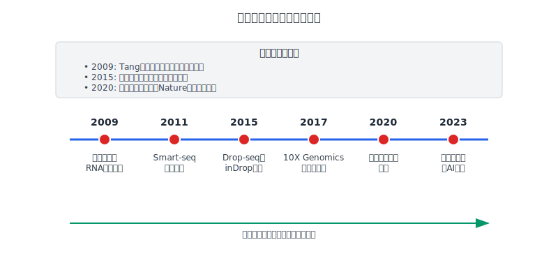
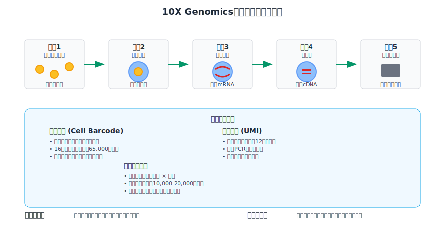
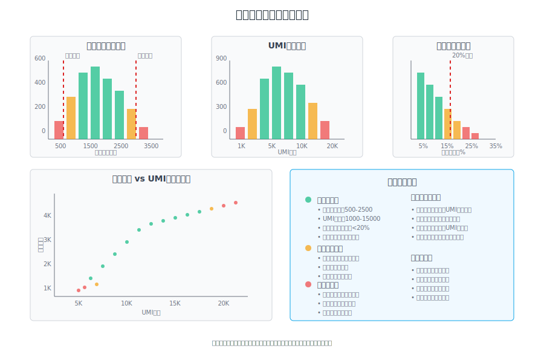
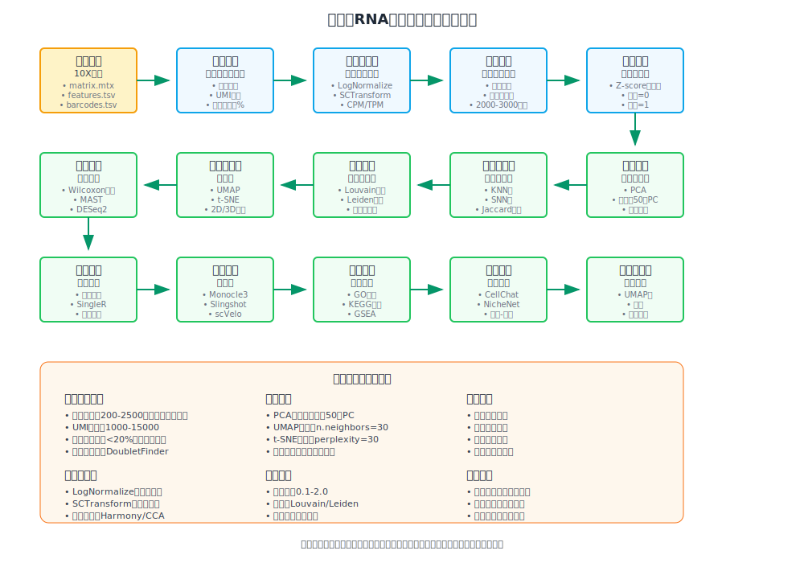
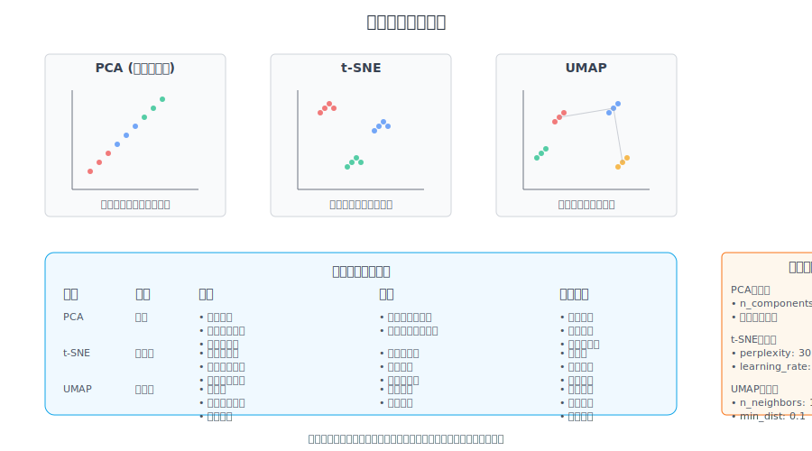
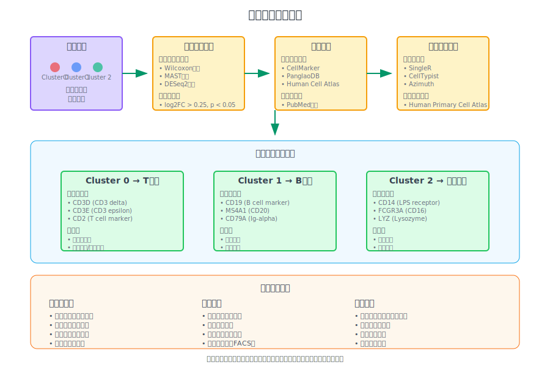
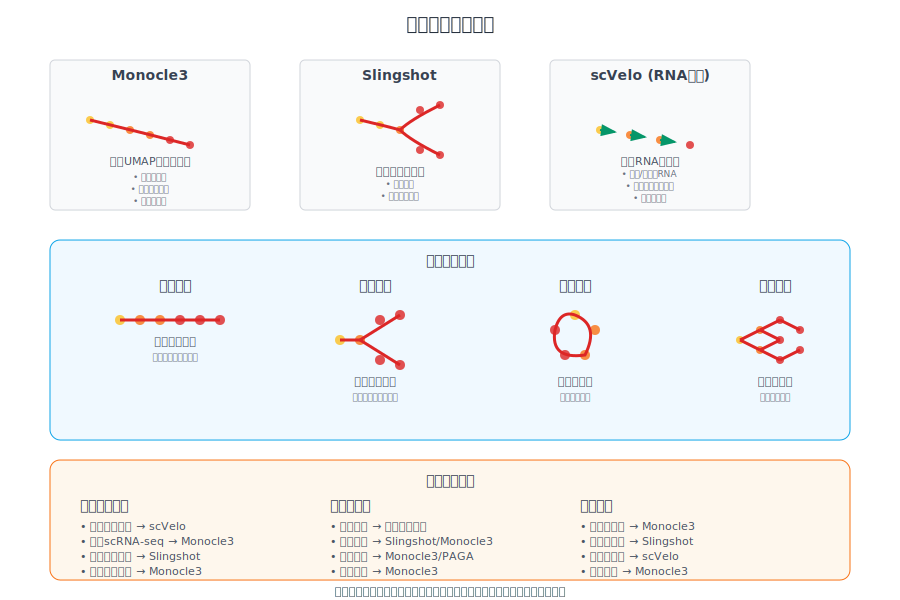
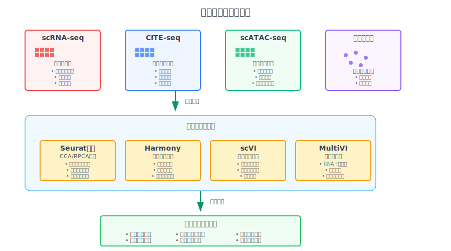
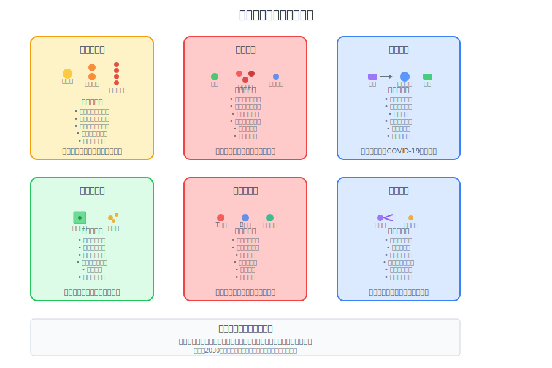

<!-- 
第7次课：单细胞测序数据分析
课程名称：高通量测序数据分析
主讲教师：王运生
联系邮箱：wangys@hunau.edu.cn
办公室：16教420室
上课地点：105机房
-->

<!-- _class: title -->
# 第7次课：单细胞测序数据分析
## 高通量测序数据分析

**主讲教师：** 王运生  
**联系邮箱：** wangys@hunau.edu.cn  
**办 公 室：** 16教420室  
**上课地点：** 105机房  

---

<!-- _class: toc -->
# 本次课程内容

1. 单细胞测序技术概述
2. 单细胞数据特征与挑战
3. 单细胞数据分析流程
4. 细胞聚类与类型注释
5. 轨迹分析与发育研究
6. 实践操作：Seurat分析流程

---

## 学习目标
- 理解单细胞测序技术的原理和发展历程
- 掌握单细胞数据的特征和分析挑战
- 学会使用Seurat进行单细胞数据分析
- 掌握细胞类型注释和轨迹分析方法
- 了解单细胞测序在生物医学研究中的应用

---

<!-- _class: content -->
# 1. 单细胞测序技术概述

## 1.1 什么是单细胞测序？

**定义：** 在单个细胞水平上进行基因组、转录组、表观基因组等分子信息的测序分析

**核心优势：**
- 揭示细胞异质性
- 发现稀有细胞类型
- 追踪细胞发育轨迹
- 理解疾病机制

---

## 1.2 单细胞测序技术发展历程

**2009年：** 第一个单细胞RNA测序研究
**2011年：** Smart-seq技术发展
**2015年：** Drop-seq和inDrop技术
**2017年：** 10X Genomics商业化平台
**2020年：** 空间转录组学兴起

---

<!-- _class: image -->


---

<!-- _class: multi-column -->
# 1.3 单细胞测序技术分类

<div class="columns">
<div class="column">

## 基于平台的分类
- **基于孔板的方法**
  - Smart-seq2/3
  - CEL-seq2
  - MARS-seq

- **基于微滴的方法**
  - Drop-seq
  - inDrop
  - 10X Genomics

</div>
<div class="column">

## 基于内容的分类
- **scRNA-seq**：转录组
- **scDNA-seq**：基因组
- **scATAC-seq**：染色质可及性
- **scChIP-seq**：组蛋白修饰
- **scBS-seq**：DNA甲基化

</div>
</div>

---

<!-- _class: image -->


---

## 1.4 10X Genomics技术原理

**核心步骤：**
1. **细胞捕获**：微滴包裹单个细胞
2. **细胞裂解**：释放mRNA分子
3. **逆转录**：合成带有细胞条码的cDNA
4. **扩增**：PCR扩增cDNA文库
5. **测序**：高通量测序获得数据

---

<!-- _class: multi-column -->
# 1.5 单细胞测序的优势与局限

<div class="columns">
<div class="column">

## 主要优势
- **高分辨率**：单细胞水平分析
- **发现异质性**：识别细胞亚群
- **时间序列**：追踪发育过程
- **功能研究**：基因调控网络

</div>
<div class="column">

## 技术局限
- **检测敏感性**：dropout现象
- **技术噪音**：批次效应
- **成本较高**：实验和分析成本
- **数据复杂**：分析方法挑战

</div>
</div>

---

<!-- _class: content -->
# 2. 单细胞数据特征与挑战

## 2.1 单细胞数据的独特特征

**稀疏性（Sparsity）：**
- 大量基因在单个细胞中不表达
- 技术性零值 vs 生物学零值
- dropout现象普遍存在

**异质性（Heterogeneity）：**
- 细胞类型异质性
- 细胞状态异质性
- 技术异质性

---

## 2.2 数据质量控制指标

**细胞水平质控：**
- 检测到的基因数量
- 总UMI/reads数量
- 线粒体基因比例
- 核糖体基因比例

**基因水平质控：**
- 表达该基因的细胞数量
- 基因表达水平分布
- 基因长度偏好性

---

<!-- _class: image -->


---

## 2.3 批次效应与技术噪音

<div class="columns">
<div class="column">

**批次效应来源：**
- 实验操作差异
- 测序平台差异
- 样本处理时间
- 环境条件变化

</div>
<div class="column">

**技术噪音类型：**
- 扩增偏好性
- 测序深度不均
- 细胞捕获效率
- 逆转录效率

</div>
</div>

---

<!-- _class: multi-column -->
# 2.4 单细胞数据分析挑战

<div class="columns">
<div class="column">

## 计算挑战
- **数据规模大**：百万级细胞
- **维度高**：万级基因
- **稀疏性**：大量零值
- **噪音多**：技术和生物噪音

</div>
<div class="column">

## 生物学挑战
- **细胞类型定义**：连续vs离散
- **发育轨迹**：分支和收敛
- **基因调控**：网络复杂性
- **功能验证**：实验验证困难

</div>
</div>

---

<!-- _class: content -->
# 3. 单细胞数据分析流程

## 3.1 标准分析流程概览

1. **数据预处理**：质量控制、标准化
2. **特征选择**：高变基因识别
3. **降维分析**：PCA、t-SNE、UMAP
4. **细胞聚类**：图聚类、层次聚类
5. **差异表达**：标记基因识别
6. **细胞注释**：类型和状态标注
7. **轨迹分析**：伪时间分析
8. **功能分析**：通路富集分析

---

<!-- _class: image -->


---

## 3.2 数据预处理

**原始数据格式：**
- **10X格式**：matrix.mtx, features.tsv, barcodes.tsv
- **H5格式**：HDF5二进制格式
- **文本格式**：基因表达矩阵

**质量控制步骤：**
1. 过滤低质量细胞
2. 过滤低表达基因
3. 检测双细胞（doublets）
4. 去除环境RNA污染

---

## 3.3 数据标准化方法

**标准化目的：**
- 消除测序深度差异
- 减少技术噪音影响
- 使细胞间可比较

**常用方法：**
- **CPM/TPM**：每百万计数标准化
- **SCTransform**：方差稳定变换
- **DESeq2**：基于负二项分布
- **Scran**：池化标准化

---

<!-- _class: multi-column -->
# 3.4 特征选择策略

<div class="columns">
<div class="column">

## 高变基因选择
- **方差-均值关系**
- **离散度模型**
- **信息量评估**
- **生物学先验知识**

</div>
<div class="column">

## 选择标准
- 表达水平适中
- 细胞间变异大
- 技术噪音小
- 生物学意义明确

</div>
</div>

---

## 3.5 降维分析方法

**线性降维：**
- **PCA**：主成分分析
- **ICA**：独立成分分析
- **NMF**：非负矩阵分解

**非线性降维：**
- **t-SNE**：t分布随机邻域嵌入
- **UMAP**：均匀流形逼近投影
- **diffusion maps**：扩散映射

---

<!-- _class: image -->


---

<!-- _class: content -->
# 4. 细胞聚类与类型注释

## 4.1 细胞聚类算法

**基于图的聚类：**
- **Louvain算法**：模块度优化
- **Leiden算法**：改进的Louvain
- **SNN聚类**：共享最近邻

**传统聚类方法：**
- **K-means**：质心聚类
- **层次聚类**：树状聚类
- **DBSCAN**：密度聚类

---

## 4.2 聚类质量评估

**内部评估指标：**
- **轮廓系数**：聚类紧密度
- **Calinski-Harabasz指数**
- **Davies-Bouldin指数**

**生物学评估：**
- **标记基因表达**
- **功能一致性**
- **已知细胞类型对应**

---

<!-- _class: multi-column -->
# 4.3 细胞类型注释方法

<div class="columns">
<div class="column">

## 基于标记基因
- **已知标记基因**
- **差异表达分析**
- **基因集富集**
- **文献调研**

</div>
<div class="column">

## 自动注释方法
- **SingleR**：参考数据库
- **CellTypist**：机器学习
- **Azimuth**：映射注释
- **scType**：基因集评分

</div>
</div>

---

## 4.4 标记基因识别

**差异表达分析：**
- **Wilcoxon秩和检验**
- **t检验**
- **负二项分布检验**
- **MAST**：混合效应模型

**标记基因特征：**
- 高表达水平
- 高特异性
- 低噪音水平
- 生物学意义

---

<!-- _class: image -->


---

## 4.5 细胞状态分析

**细胞周期分析：**
- G1/S/G2M期标记基因
- 细胞周期评分
- 周期效应回归

**细胞激活状态：**
- 应激反应基因
- 代谢活跃度
- 增殖状态

---

<!-- _class: content -->
# 5. 轨迹分析与发育研究

## 5.1 轨迹分析概念

**伪时间（Pseudotime）：**
- 基于基因表达相似性排序细胞
- 推断细胞发育或分化轨迹
- 不等同于真实时间

**轨迹类型：**
- **线性轨迹**：单一发育路径
- **分支轨迹**：多重分化命运
- **循环轨迹**：细胞周期等

---

## 5.2 轨迹分析算法

**经典算法：**
- **Monocle**：独立成分分析
- **Slingshot**：最小生成树
- **PAGA**：分区图抽象

**深度学习方法：**
- **scVelo**：RNA速度
- **CellRank**：马尔可夫链
- **Palantir**：扩散图

---

<!-- _class: image -->


---

## 5.3 RNA速度分析

**基本原理：**
- 利用内含子和外显子reads比例
- 推断基因表达变化方向
- 预测细胞未来状态

**技术要点：**
- 需要包含内含子的测序数据
- 计算剪接和未剪接RNA比例
- 建立动力学模型

---

<!-- _class: multi-column -->
# 5.4 轨迹分析应用

<div class="columns">
<div class="column">

## 发育生物学
- **胚胎发育**：细胞命运决定
- **器官发生**：组织形成过程
- **干细胞分化**：多能性丢失
- **再生医学**：组织修复

</div>
<div class="column">

## 疾病研究
- **肿瘤进展**：恶性转化
- **免疫反应**：激活过程
- **神经退行**：疾病进程
- **药物反应**：治疗响应

</div>
</div>

---

## 5.5 轨迹分析结果解读

**关键节点识别：**
- 分支点（Branch points）
- 终端状态（Terminal states）
- 转换区域（Transition zones）

**动态基因识别：**
- 轨迹相关基因
- 分支特异基因
- 时间依赖基因

---

<!-- _class: content -->
# 6. 单细胞多组学整合

## 6.1 多组学数据类型

**同一细胞多组学：**
- **scNMT-seq**：甲基化+转录组
- **scCAT-seq**：染色质+转录组
- **scTrio-seq**：拷贝数+甲基化+转录组

**不同细胞多组学：**
- 转录组 + 蛋白质组
- 转录组 + 染色质可及性
- 转录组 + 空间信息

---

## 6.2 数据整合方法

**基于相关性：**
- **Canonical Correlation Analysis (CCA)**
- **Mutual Nearest Neighbors (MNN)**
- **Harmony**

**基于深度学习：**
- **scVI**：变分自编码器
- **MultiVI**：多模态整合
- **totalVI**：蛋白质+RNA

---

<!-- _class: image -->


---

## 6.3 空间转录组学

**技术平台：**
- **10X Visium**：基于芯片
- **Slide-seq**：基于珠子
- **MERFISH**：基于成像
- **seqFISH**：原位杂交

**分析特点：**
- 保留空间位置信息
- 组织结构分析
- 细胞通讯研究

---

<!-- _class: content -->
# 7. 单细胞数据分析工具

## 7.1 主要分析平台

**R语言生态：**
- **Seurat**：最流行的R包
- **SingleCellExperiment**：Bioconductor框架
- **Monocle3**：轨迹分析专用
- **scater**：质量控制和可视化

**Python生态：**
- **Scanpy**：Python版Seurat
- **scVelo**：RNA速度分析
- **CellRank**：轨迹分析
- **squidpy**：空间数据分析

---

## 7.2 Seurat分析流程

**核心功能：**
1. 数据导入和质控
2. 标准化和特征选择
3. 降维和聚类
4. 差异表达分析
5. 细胞类型注释
6. 数据整合

---

<!-- _class: code -->
# 7.3 Seurat基本代码示例

```r
# 加载必要的包
library(Seurat)
library(dplyr)
library(ggplot2)

# 读取10X数据
data <- Read10X(data.dir = "path/to/10x/data")
seurat_obj <- CreateSeuratObject(counts = data)

# 质量控制
seurat_obj[["percent.mt"]] <- PercentageFeatureSet(seurat_obj, pattern = "^MT-")
VlnPlot(seurat_obj, features = c("nFeature_RNA", "nCount_RNA", "percent.mt"))

# 过滤细胞
seurat_obj <- subset(seurat_obj, subset = nFeature_RNA > 200 & 
                     nFeature_RNA < 2500 & percent.mt < 20)
```

---

<!-- _class: code -->
# 7.4 标准化和降维

```r
# 标准化
seurat_obj <- NormalizeData(seurat_obj)

# 寻找高变基因
seurat_obj <- FindVariableFeatures(seurat_obj, selection.method = "vst")

# 缩放数据
seurat_obj <- ScaleData(seurat_obj)

# PCA分析
seurat_obj <- RunPCA(seurat_obj, features = VariableFeatures(object = seurat_obj))

# UMAP降维
seurat_obj <- RunUMAP(seurat_obj, dims = 1:10)
```

---

<!-- _class: code -->
# 7.5 聚类和注释

```r
# 构建邻接图
seurat_obj <- FindNeighbors(seurat_obj, dims = 1:10)

# 聚类
seurat_obj <- FindClusters(seurat_obj, resolution = 0.5)

# 可视化
DimPlot(seurat_obj, reduction = "umap", label = TRUE)

# 寻找标记基因
markers <- FindAllMarkers(seurat_obj, only.pos = TRUE, min.pct = 0.25)

# 查看top基因
top_markers <- markers %>% group_by(cluster) %>% top_n(n = 2, wt = avg_log2FC)
```

---

<!-- _class: content -->
# 8. 单细胞测序应用实例

## 8.1 发育生物学应用

**胚胎发育研究：**
- 小鼠胚胎发育图谱
- 人类胚胎发育轨迹
- 器官发生过程
- 细胞命运决定

**案例：小鼠大脑发育**
- 神经干细胞分化
- 神经元亚型产生
- 胶质细胞发育
- 神经回路形成

---

## 8.2 疾病研究应用

**肿瘤异质性：**
- 肿瘤细胞亚群识别
- 肿瘤微环境分析
- 耐药机制研究
- 转移过程追踪

**免疫系统疾病：**
- 免疫细胞分化
- 炎症反应机制
- 自身免疫疾病
- 疫苗反应评估

---

<!-- _class: image -->


---

## 8.3 药物研发应用

**药物筛选：**
- 细胞毒性评估
- 药物作用机制
- 耐药性机制
- 药物协同效应

**个性化医疗：**
- 患者分层
- 治疗反应预测
- 副作用评估
- 治疗方案优化

---

## 8.4 农业和环境应用

**植物生物学：**
- 植物发育过程
- 胁迫响应机制
- 品种改良
- 作物优化

**微生物生态：**
- 微生物群落结构
- 环境适应机制
- 生物地球化学循环
- 污染修复

---

<!-- _class: content -->
# 9. 单细胞测序前沿发展

## 9.1 技术发展趋势

**通量提升：**
- 百万级细胞分析
- 成本持续下降
- 自动化程度提高
- 标准化流程

**精度改进：**
- 全长转录本测序
- 等位基因特异分析
- 亚细胞定位
- 实时动态监测

---

## 9.2 新兴技术

**空间多组学：**
- 空间转录组+蛋白质组
- 空间表观基因组
- 三维空间重构
- 时空动态分析

**活细胞分析：**
- Live-seq技术
- 非破坏性取样
- 连续时间点分析
- 细胞命运追踪

---

## 9.3 计算方法创新

**人工智能应用：**
- 深度学习模型
- 图神经网络
- 强化学习
- 联邦学习

**大数据整合：**
- 跨物种比较
- 多中心数据整合
- 云计算平台
- 标准化数据库

---

<!-- _class: multi-column -->
# 9.4 挑战与机遇

<div class="columns">
<div class="column">

## 技术挑战
- **数据标准化**：批次效应
- **计算复杂度**：大规模数据
- **结果重现性**：方法标准化
- **生物学解释**：功能验证

</div>
<div class="column">

## 发展机遇
- **精准医学**：个体化治疗
- **药物开发**：靶点发现
- **基础研究**：机制理解
- **产业应用**：商业化

</div>
</div>

---

<!-- _class: content -->
# 10. 实践操作预告

## 10.1 今天的实践内容

**数据准备：**
- 下载示例scRNA-seq数据
- 安装必要的R包
- 配置分析环境

**分析流程：**
1. 数据导入和质量控制
2. 标准化和特征选择
3. 降维分析和可视化
4. 细胞聚类
5. 标记基因识别
6. 细胞类型注释

---

## 10.2 预期学习成果

**技能掌握：**
- Seurat基本操作
- 质量控制标准
- 聚类参数调整
- 结果可视化

**分析能力：**
- 数据质量评估
- 聚类结果解读
- 生物学意义理解
- 问题诊断能力

---

## 10.3 扩展练习

**进阶分析：**
- 轨迹分析实践
- 多样本整合
- 细胞通讯分析
- 功能富集分析

**自主探索：**
- 不同参数设置
- 其他分析方法
- 文献案例重现
- 创新分析思路

---

<!-- _class: summary -->
# 本次课程总结

## 主要内容回顾
- **单细胞技术原理**：从bulk到单细胞的技术革命
- **数据特征挑战**：稀疏性、异质性、技术噪音
- **分析流程方法**：质控、标准化、聚类、注释
- **轨迹分析**：伪时间、RNA速度、发育研究
- **应用前景**：疾病研究、药物开发、精准医学

---

## 下次课程预告
- **主题**：多组学数据整合与机器学习
- **内容**：多组学整合方法、机器学习在基因组学中的应用
- **准备**：复习统计学和机器学习基础知识

## **作业/练习：**
- 完成今天的Seurat分析流程
- 尝试不同的聚类参数设置
- 阅读提供的参考文献

---

<!-- _class: end -->
# 谢谢大家！

**有问题请联系：**
- 邮箱：wangys@hunau.edu.cn
- 办公室：16教420室
