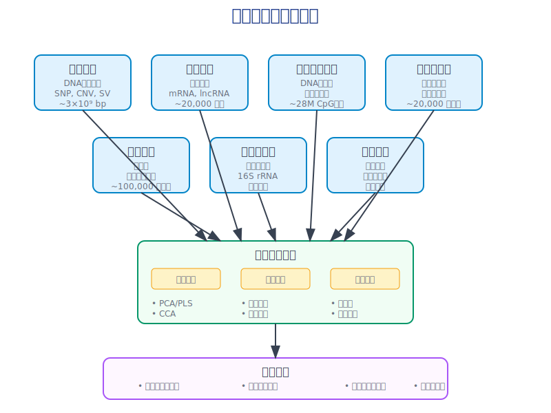
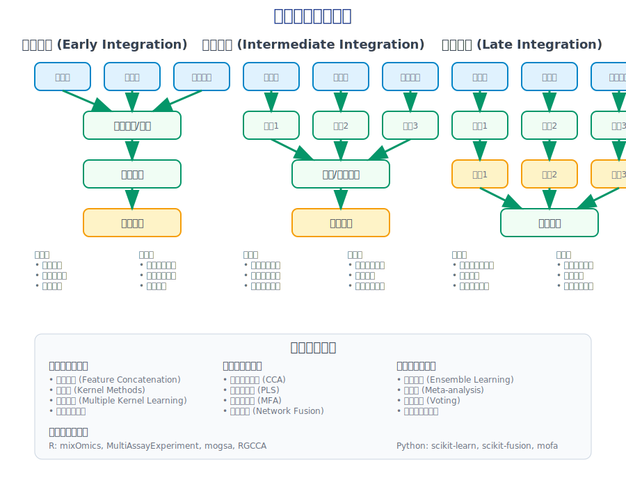
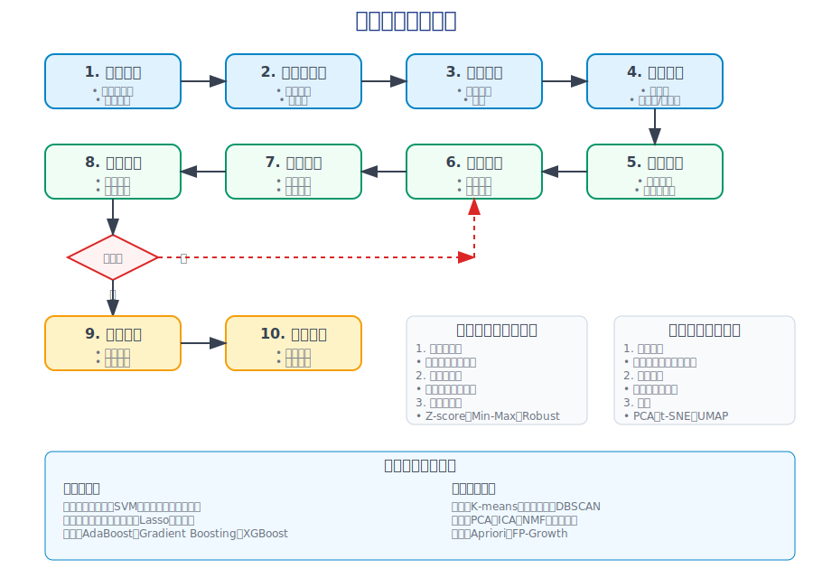
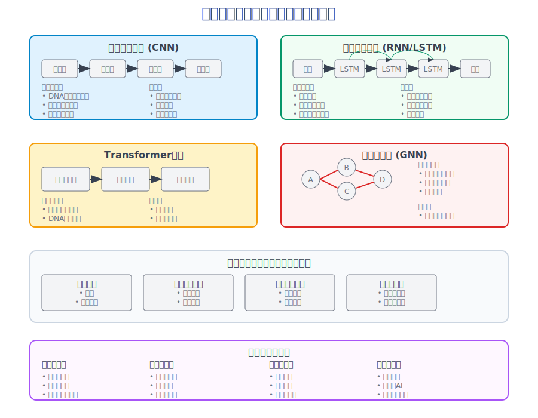
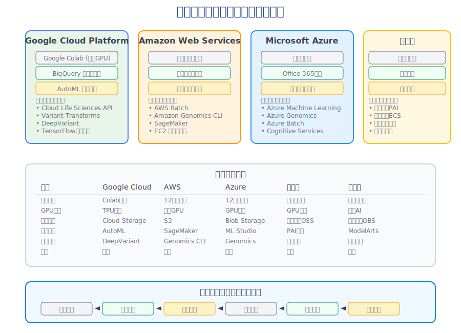

<!-- 
第8次课：多组学数据整合与机器学习
课程名称：高通量测序数据分析
主讲教师：王运生
联系邮箱：wangys@hunau.edu.cn
办公室：16教420室
上课地点：105机房
-->

<!-- _class: title -->
# 第8次课：多组学数据整合与机器学习
## 高通量测序数据分析

**主讲教师：** 王运生  
**联系邮箱：** wangys@hunau.edu.cn  
**办公室：** 16教420室  
**上课地点：** 105机房  

---

<!-- _class: toc -->
# 本次课程内容

1. **多组学数据整合概述**
2. **数据整合的统计方法**
3. **机器学习基础与应用**
4. **深度学习前沿技术**
5. **实践操作与云计算体验**

---

## 学习目标

### 理论目标
- 理解多组学数据整合的基本概念和挑战
- 掌握常用的数据整合方法和策略
- 了解机器学习在生物信息学中的应用场景
- 认识深度学习在基因组学中的前沿应用

### 实践目标
- 掌握多组学数据的预处理和标准化方法
- 学会使用R和Python进行数据整合分析
- 实践机器学习算法在生物数据中的应用
- 体验云计算平台进行大规模数据分析

---

<!-- _class: content -->
# 第一部分：多组学数据整合概述

## 什么是多组学数据整合？

**定义：** 将来自同一生物系统的不同分子层面的数据进行联合分析，以获得更全面的生物学理解。

**主要组学类型：**
- **基因组学** (Genomics)：DNA序列变异
- **转录组学** (Transcriptomics)：基因表达
- **蛋白质组学** (Proteomics)：蛋白质表达
- **代谢组学** (Metabolomics)：代谢物
- **表观基因组学** (Epigenomics)：DNA甲基化、组蛋白修饰

---

<!-- _class: image -->


---

## 多组学整合的挑战

<div class="columns">
<div class="column">

### 技术挑战
- **数据异质性**：不同平台、不同格式
- **数据规模差异**：特征数量差异巨大
- **数据质量**：缺失值、批次效应
- **标准化问题**：不同组学数据的标准化方法

</div>
<div class="column">

### 生物学挑战
- **时空特异性**：不同组学反映不同时间点
- **调控复杂性**：多层次调控网络
- **功能关联**：分子间相互作用
- **因果关系**：相关性vs因果性

</div>
</div>

---

## 多组学整合的应用场景

### 疾病研究
- **癌症分型**：基于多组学特征的肿瘤分类
- **药物靶点发现**：整合多层面数据识别治疗靶点
- **生物标志物**：多组学生物标志物的发现

### 基础研究
- **发育生物学**：细胞分化过程的多组学解析
- **系统生物学**：生物网络的构建和分析
- **进化生物学**：物种进化的多组学证据

---

<!-- _class: content -->
# 第二部分：数据整合的统计方法

## 数据整合策略分类

<div class="columns">
<div class="column">

### 早期整合 (Early Integration)
- **特征级整合**：直接合并不同组学特征
- **优点**：简单直接，计算效率高
- **缺点**：忽略组学间差异，可能丢失信息

### 中期整合 (Intermediate Integration)
- **转换后整合**：先转换再整合
- **网络整合**：基于网络的整合方法

</div>
<div class="column">

### 晚期整合 (Late Integration)
- **结果级整合**：分别分析后整合结果
- **优点**：保持各组学特性
- **缺点**：可能错过组学间相互作用

### 混合整合 (Hybrid Integration)
- **多层次整合**：结合多种策略
- **自适应整合**：根据数据特性选择策略

</div>
</div>

---

<!-- _class: image -->


---

## 主要统计方法

### 1. 主成分分析类方法

**多重因子分析 (Multiple Factor Analysis, MFA)**
- 适用于不同类型的数据表
- 考虑各数据表的权重
- 提供全局和局部视图

**多重对应分析 (Multiple Correspondence Analysis, MCA)**
- 适用于分类变量
- 降维和可视化
- 识别变量间关联

---

### 2. 典型相关分析类方法

**典型相关分析 (Canonical Correlation Analysis, CCA)**
- 寻找两个数据集间的最大相关性
- 识别共同变异模式
- 适用于两个组学数据

**稀疏典型相关分析 (Sparse CCA)**
- 引入稀疏性约束
- 特征选择功能
- 提高解释性

---

### 3. 矩阵分解方法

**非负矩阵分解 (Non-negative Matrix Factorization, NMF)**
- 将数据分解为非负因子
- 生物学解释性强
- 适用于表达数据

**张量分解 (Tensor Decomposition)**
- 处理多维数据
- 保持数据结构
- 适用于时间序列多组学数据

---

### 4. 贝叶斯方法

**贝叶斯网络**
- 建模变量间因果关系
- 处理不确定性
- 整合先验知识

**层次贝叶斯模型**
- 多层次建模
- 共享信息
- 处理批次效应

---

<!-- _class: content -->
# 第三部分：机器学习基础与应用

## 机器学习在生物信息学中的应用

### 监督学习应用
- **疾病分类**：基于组学数据的疾病诊断
- **药物反应预测**：预测患者对药物的反应
- **功能预测**：预测基因或蛋白质功能
- **生存分析**：预测患者生存时间

### 无监督学习应用
- **聚类分析**：发现新的疾病亚型
- **降维可视化**：高维数据的可视化
- **异常检测**：识别异常样本
- **模式发现**：发现隐藏的生物学模式

---

<!-- _class: image -->


---

## 常用机器学习算法

<div class="columns">
<div class="column">

### 分类算法
- **随机森林** (Random Forest)
  - 集成学习方法
  - 处理高维数据
  - 特征重要性评估

- **支持向量机** (SVM)
  - 处理非线性问题
  - 核函数技巧
  - 小样本效果好

</div>
<div class="column">

### 回归算法
- **岭回归** (Ridge Regression)
  - L2正则化
  - 处理多重共线性
  - 稳定性好

- **Lasso回归**
  - L1正则化
  - 特征选择
  - 稀疏解

</div>
</div>

---

### 集成学习方法

**Bagging方法**
- 随机森林
- Extra Trees
- 减少过拟合

**Boosting方法**
- AdaBoost
- Gradient Boosting
- XGBoost
- 提高预测精度

**Stacking方法**
- 多层次集成
- 元学习器
- 充分利用不同算法优势

---

## 特征选择与降维

### 特征选择方法

<div class="columns">
<div class="column">

**过滤方法 (Filter)**
- 相关系数
- 卡方检验
- 互信息
- 计算效率高

**包装方法 (Wrapper)**
- 递归特征消除
- 前向/后向选择
- 考虑特征交互

</div>
<div class="column">

**嵌入方法 (Embedded)**
- Lasso正则化
- 随机森林重要性
- 集成特征选择和模型训练

**混合方法**
- 多步骤特征选择
- 结合多种方法优势
- 提高稳定性

</div>
</div>

---

### 降维方法

**线性降维**
- 主成分分析 (PCA)
- 线性判别分析 (LDA)
- 独立成分分析 (ICA)

**非线性降维**
- t-SNE
- UMAP
- 自编码器
- 流形学习

---

## 模型评估与验证

### 评估指标

<div class="columns">
<div class="column">

**分类问题**
- 准确率 (Accuracy)
- 精确率 (Precision)
- 召回率 (Recall)
- F1分数
- AUC-ROC

</div>
<div class="column">

**回归问题**
- 均方误差 (MSE)
- 平均绝对误差 (MAE)
- R²决定系数
- 均方根误差 (RMSE)

</div>
</div>

### 交叉验证策略
- K折交叉验证
- 留一法交叉验证
- 分层交叉验证
- 时间序列交叉验证

---

<!-- _class: content -->
# 第四部分：深度学习前沿技术

## 深度学习在生物信息学中的应用

### 序列分析
- **基因预测**：识别编码序列
- **启动子识别**：转录起始位点预测
- **剪接位点预测**：内含子-外显子边界
- **蛋白质结构预测**：二级和三级结构

### 图像分析
- **细胞图像分析**：细胞分割和分类
- **病理图像诊断**：癌症诊断
- **显微镜图像处理**：自动化分析

---

<!-- _class: image -->


---

## 主要深度学习架构

### 卷积神经网络 (CNN)

**应用场景：**
- DNA序列模式识别
- 蛋白质结构预测
- 医学图像分析

**优势：**
- 局部特征提取
- 参数共享
- 平移不变性

**典型架构：**
- LeNet, AlexNet, VGG
- ResNet, DenseNet
- 专用生物信息学CNN

---

### 循环神经网络 (RNN)

**应用场景：**
- 序列标注
- 时间序列分析
- 语言模型

**变体：**
- LSTM (长短期记忆网络)
- GRU (门控循环单元)
- 双向RNN

**生物信息学应用：**
- 基因表达时间序列分析
- 蛋白质序列分析
- 代谢路径预测

---

### Transformer架构

**核心机制：**
- 自注意力机制
- 位置编码
- 多头注意力

**生物信息学应用：**
- 蛋白质语言模型 (ESM, ProtBERT)
- DNA序列分析 (DNABERT)
- 药物-靶点相互作用预测

**优势：**
- 并行计算
- 长距离依赖
- 可解释性

---

### 图神经网络 (GNN)

**应用场景：**
- 蛋白质相互作用网络
- 代谢网络分析
- 药物发现

**主要类型：**
- 图卷积网络 (GCN)
- 图注意力网络 (GAT)
- GraphSAGE

**优势：**
- 处理非欧几里得数据
- 保持图结构信息
- 节点和图级别预测

---

## 深度学习在多组学中的应用

### 自编码器 (Autoencoder)

**变分自编码器 (VAE)**
- 生成式模型
- 潜在空间表示
- 数据生成和插值

**去噪自编码器**
- 鲁棒特征学习
- 处理噪声数据
- 数据重构

**应用：**
- 多组学数据降维
- 缺失值填补
- 异常检测

---

### 生成对抗网络 (GAN)

**基本原理：**
- 生成器 vs 判别器
- 对抗训练
- 纳什均衡

**生物信息学应用：**
- 合成生物数据
- 数据增强
- 药物分子生成

**变体：**
- WGAN, LSGAN
- CycleGAN
- StyleGAN

---

### 多模态深度学习

**融合策略：**
- 早期融合：特征级融合
- 晚期融合：决策级融合
- 中间融合：隐藏层融合

**架构设计：**
- 共享编码器
- 模态特定编码器
- 注意力机制融合

**应用实例：**
- 多组学癌症分型
- 药物反应预测
- 疾病风险评估

---

## 深度学习的挑战与解决方案

### 主要挑战

<div class="columns">
<div class="column">

**数据相关**
- 小样本问题
- 数据不平衡
- 标注成本高
- 批次效应

**模型相关**
- 过拟合风险
- 可解释性差
- 计算资源需求
- 超参数调优

</div>
<div class="column">

**应用相关**
- 领域知识整合
- 模型泛化能力
- 实际部署困难
- 监管和伦理问题

</div>
</div>

### 解决策略
- 迁移学习和预训练模型
- 数据增强和合成数据
- 正则化和dropout
- 可解释AI技术
- 联邦学习

---

<!-- _class: content -->
# 第五部分：云计算与大数据平台

## 云计算在生物信息学中的优势

### 计算资源优势
- **弹性扩展**：按需分配计算资源
- **成本效益**：避免硬件投资和维护
- **高性能计算**：GPU/TPU加速
- **存储容量**：海量数据存储

### 协作优势
- **数据共享**：便于团队协作
- **版本控制**：代码和数据版本管理
- **可重现性**：标准化计算环境
- **全球访问**：随时随地访问

---

<!-- _class: image -->


---

## 主要云计算平台

<div class="columns">
<div class="column">

### Google Cloud Platform
**优势：**
- Google Colab免费GPU
- BigQuery大数据分析
- AutoML机器学习
- 与TensorFlow深度集成

**生物信息学工具：**
- Cloud Life Sciences API
- Variant Transforms
- DeepVariant

</div>
<div class="column">

### Amazon Web Services (AWS)
**优势：**
- 丰富的服务生态
- 强大的计算能力
- 完善的安全体系
- 全球数据中心

**生物信息学工具：**
- AWS Batch
- Amazon Genomics CLI
- SageMaker

</div>
</div>

---

### 其他重要平台

**Microsoft Azure**
- Azure Machine Learning
- Azure Genomics
- 与Office 365集成

**阿里云**
- 弹性计算服务
- 机器学习平台PAI
- 本土化服务

**华为云**
- ModelArts AI开发平台
- 基因容器服务
- 国产化解决方案

---

## 云端生物信息学工作流

### 数据管理
- **数据上传**：高速传输工具
- **数据存储**：对象存储服务
- **数据安全**：加密和访问控制
- **数据备份**：多地域备份

### 计算任务
- **任务调度**：批处理系统
- **资源管理**：自动扩缩容
- **监控告警**：实时监控
- **成本控制**：资源使用优化

---

### 开发环境

**Jupyter Notebook**
- 交互式开发
- 可视化展示
- 文档化分析
- 易于分享

**容器化部署**
- Docker容器
- Kubernetes编排
- 环境一致性
- 快速部署

**版本控制**
- Git代码管理
- 数据版本控制
- 实验追踪
- 协作开发

---

## 实际应用案例

### 癌症基因组图谱 (TCGA)
- **数据规模**：PB级多组学数据
- **计算需求**：大规模并行计算
- **云端解决方案**：
  - 数据存储在云端
  - 提供标准化分析流程
  - 支持用户自定义分析

### 英国生物样本库
- **样本规模**：50万人群队列
- **数据类型**：基因组、影像、健康记录
- **云端架构**：
  - 安全的数据访问
  - 高性能计算环境
  - 研究者协作平台

---

### 新冠病毒基因组监测
- **全球合作**：实时数据共享
- **快速分析**：变异株识别
- **云端优势**：
  - 快速部署分析流程
  - 全球数据整合
  - 实时结果发布

---

<!-- _class: content -->
# 实践操作预览

## 今天的实践内容

### 1. 多组学数据预处理 (30分钟)
- 数据质量评估
- 标准化和归一化
- 批次效应校正

### 2. 数据整合分析 (45分钟)
- 使用mixOmics进行PLS-DA分析
- 多组学网络构建
- 结果可视化

### 3. 机器学习实践 (30分钟)
- 特征选择
- 模型训练和评估
- 结果解释

### 4. 云计算平台体验 (15分钟)
- Google Colab使用
- GPU加速计算
- 结果分享

---

## 实践环境准备

### 本地环境
```bash
# R环境
install.packages(c("mixOmics", "caret", "randomForest"))

# Python环境
pip install pandas numpy scikit-learn matplotlib seaborn
```

### 云端环境
- Google Colab账号
- 预配置的Notebook
- 示例数据集

---

<!-- _class: summary -->
# 本次课程总结

## 主要内容回顾

### 理论知识
- **多组学整合**：概念、挑战、策略
- **统计方法**：PCA、CCA、矩阵分解、贝叶斯方法
- **机器学习**：监督学习、无监督学习、特征选择
- **深度学习**：CNN、RNN、Transformer、GNN
- **云计算**：平台比较、工作流、应用案例

### 实践技能
- 多组学数据预处理和整合
- 机器学习模型构建和评估
- 云计算平台使用

---

## 下次课程预告

### 课程总结与展望
- **课程内容回顾**：8次课程要点总结
- **前沿技术展望**：生物信息学发展趋势
- **职业发展指导**：相关职业路径介绍
- **项目展示**：学生项目成果展示

### 需要准备的内容
- 整理课程笔记和实践代码
- 准备个人项目展示（可选）
- 思考课程学习心得

## **作业/练习：**
1. 完成多组学数据整合分析报告
2. 尝试在Google Colab上运行深度学习示例
3. 阅读推荐文献，了解最新研究进展

---

<!-- _class: end -->
# 谢谢大家！

**有问题请联系：**
- 邮箱：wangys@hunau.edu.cn
- 办公室：16教420室

**课程资料：**
- 实践手册：详细操作步骤
- 示例代码：GitHub仓库
- 参考资料：推荐阅读列表