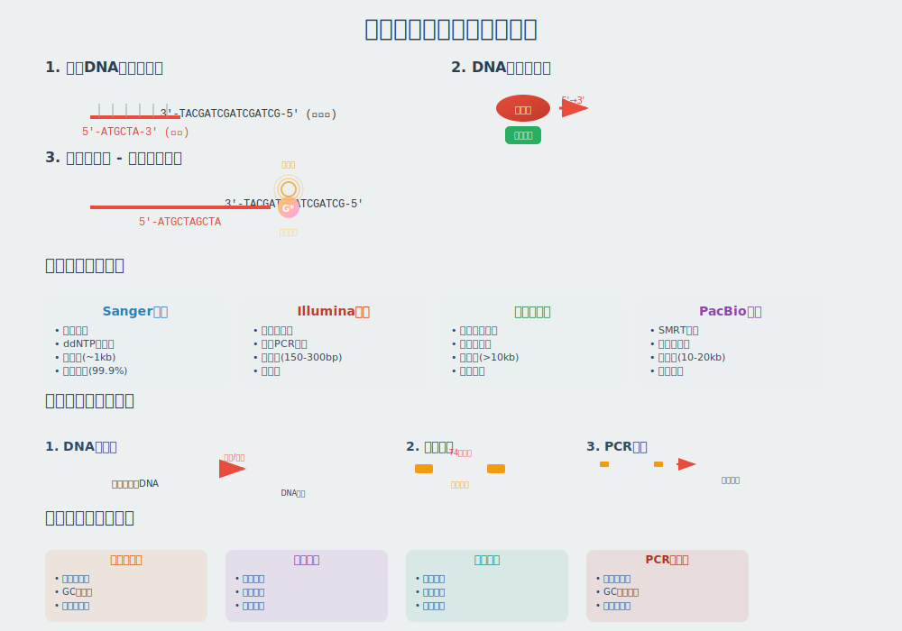

<!--
预备课：分子生物学基础
课程名称：高通量测序数据分析
主讲教师：王运生
联系邮箱：wangys@hunau.edu.cn
办公室：16教420室
上课地点：105机房
课程时长：4小时
-->

<!-- _class: title -->
# 预备课：分子生物学基础
## 高通量测序数据分析

**主讲教师：** 王运生
**联系邮箱：** wangys@hunau.edu.cn
**办公室：** 16教420室
**上课地点：** 105机房

---

<!-- _class: toc -->
# 本次课程内容

1. **DNA结构与复制**
2. **RNA与转录**
3. **蛋白质与翻译**
4. **基因组结构与组织**
5. **生物信息学中的分子生物学概念**
6. **测序技术的分子生物学基础**

---

# 学习目标
- 掌握DNA、RNA、蛋白质的基本结构和功能
- 理解中心法则及其在生物信息学中的意义
- 了解基因组结构和基因调控的基本概念
- 为后续NGS数据分析课程打下坚实基础

---

<!-- _class: content -->
# 第一部分：DNA结构与复制

<div class="columns">
<div class="column">

### DNA的基本结构
- 核苷酸组成：磷酸基团、五碳糖、含氮碱基
- 四种碱基：腺嘌呤(A)、胸腺嘧啶(T)、鸟嘌呤(G)、胞嘧啶(C)
- 碱基配对规则：A-T, G-C
- 双螺旋结构：Watson-Crick模型

</div>
<div class="column">

### DNA复制机制
- 半保留复制
- 复制的方向性：5'→3'
- 前导链与滞后链
- 冈崎片段

</div>
</div>

---

<!-- _class: image -->


---

<!-- _class: multi-column -->
# DNA双螺旋结构特征

<div class="columns">
<div class="column">

## 结构特征
- 右手双螺旋
- 大沟和小沟
- 直径约2nm
- 螺距约3.4nm
- 每圈10个碱基对

</div>
<div class="column">

## 生物信息学意义
- 序列信息存储
- 3'和5'端的重要性
- 正负链概念
- 参考序列定义
- 测序读长的含义

</div>
</div>

---

<!-- _class: content -->
# DNA复制与测序技术的关系

<div class="columns">
<div class="column">

## 复制机制的重要概念
- **模板导向合成**：测序技术的基础原理
- **DNA聚合酶**：边合成边测序技术
- **引物**：测序反应的起始点
- **5'→3'方向性**：决定测序方向

</div>
<div class="column">

## 在NGS中的应用
- 扩增子测序中的PCR原理
- 文库制备过程中的DNA复制
- 桥式PCR扩增
- 测序化学反应原理

</div>
</div>

---

<!-- _class: content -->
# 第二部分：RNA与转录

<div class="columns">
<div class="column">

### RNA的基本结构
- 核糖核酸的组成
- 尿嘧啶(U)替代胸腺嘧啶(T)
- 单链结构但可形成二级结构
- RNA的种类：mRNA、tRNA、rRNA、ncRNA

</div>
<div class="column">

### 转录过程
- RNA聚合酶的作用
- 启动子识别与结合
- 转录起始、延伸和终止
- 转录后修饰

</div>
</div>

---

<!-- _class: image -->


---

<!-- _class: multi-column -->
# 真核生物转录特征

<div class="columns">
<div class="column">

## 转录过程
- 启动子序列
- 转录因子结合
- RNA聚合酶II
- 5'帽子结构
- 3'多聚A尾

</div>
<div class="column">

## 转录后修饰
- 5'加帽
- 3'多聚腺苷化
- 内含子剪切
- 选择性剪切
- RNA编辑

</div>
</div>

---

<!-- _class: content -->
# RNA-seq数据分析的分子基础

<div class="columns">
<div class="column">

## 转录组的复杂性
- **多种RNA类型**：mRNA、lncRNA、miRNA、circRNA
- **选择性剪切**：同一基因产生多个转录本
- **转录本长度变化**：不同剪切模式
- **表达量差异**：组织和时期特异性

</div>
<div class="column">

## 对数据分析的影响
- 参考基因组vs参考转录组
- 内含子区域的reads映射
- 新转录本的发现
- 差异表达分析的生物学意义

</div>
</div>

---

<!-- _class: content -->
# 第三部分：蛋白质与翻译

<div class="columns">
<div class="column">

### 蛋白质结构层次
- 一级结构：氨基酸序列
- 二级结构：α螺旋、β折叠
- 三级结构：空间折叠
- 四级结构：多亚基组装

</div>
<div class="column">

## 蛋白质与翻译
### 翻译过程
- 遗传密码的通用性
- 起始密码子和终止密码子
- 核糖体的作用
- tRNA的功能

</div>
</div>

---

<!-- _class: image -->
# 中心法则：从基因到蛋白质


---

<!-- _class: content -->
# 中心法则：从基因到蛋白质

```
DNA → RNA → 蛋白质
复制   转录   翻译
```
<div class="columns">
<div class="column">

## 中心法则的扩展
- 逆转录：RNA → DNA
- RNA复制：RNA → RNA
- 直接翻译：某些病毒

</div>
<div class="column">

## 在生物信息学中的意义
- 序列注释的层次
- 功能预测的基础
- 进化分析的框架
- 数据库组织的原则

</div>
</div>

---

<!-- _class: code -->
# 遗传密码表的信息学特征

```
起始密码子：AUG (甲硫氨酸)
终止密码子：UAG, UAA, UGA
密码子简并性：64个密码子编码20个氨基酸
```

## 密码子使用偏好性
- 不同物种的密码子偏好
- tRNA丰度的影响
- 基因表达水平的预测
- 外源基因表达优化

---

<!-- _class: content -->
# 第四部分：基因组结构与组织

<div class="columns">
<div class="column">

### 基因的结构
- 外显子与内含子
- 5'UTR和3'UTR
- 调控序列：启动子、增强子、沉默子
- 重复序列和转座元件

</div>
<div class="column">

### 基因组的层次结构
- 核苷酸水平
- 基因水平
- 染色体水平
- 基因组水平

</div>
</div>

---

<!-- _class: image -->


---

<!-- _class: multi-column -->
# 真核基因组的复杂性

<div class="columns">
<div class="column">

## 序列特征
- 基因间区域广阔
- 内含子普遍存在
- 重复序列丰富
- 假基因的存在
- 基因家族聚集

</div>
<div class="column">

## 调控元件
- 顺式调控元件
- 反式调控因子
- 表观遗传修饰
- 染色质结构
- 三维基因组组织

</div>
</div>

---

<!-- _class: content -->
# 基因组注释的生物学基础

<div class="columns">
<div class="column">

## 注释的层次
1. **序列特征**：重复序列、低复杂度区域
2. **基因预测**：编码序列、非编码RNA
3. **功能注释**：GO注释、通路分析
4. **比较注释**：同源基因、进化关系
</div>
<div class="column">

## 注释质量的影响因素
- 实验证据的完整性
- 计算预测的准确性
- 物种特异性特征
- 注释版本的更新

</div>
</div>

---

<!-- _class: content -->
# 第五部分：生物信息学中的分子生物学概念

<div class="columns">
<div class="column">

### 序列同源性
- 同源(Homology)vs相似性(Similarity)
- 直系同源(Ortholog)vs旁系同源(Paralog)
- 进化关系的推断

</div>
<div class="column">

### 保守性与变异
- 保守序列的功能意义
- 同义突变vs非同义突变
- 结构域的保守性

</div>
</div>

---

<!-- _class: content -->
# 分子进化的基本概念

<div class="columns">
<div class="column">

## 进化的分子机制
- **点突变**：转换与颠换
- **插入缺失**：移码突变的影响
- **重排**：染色体水平的变化
- **基因重复**：基因家族的形成

</div>
<div class="column">

## 选择压力的类型
- 纯化选择：保守功能
- 正向选择：适应性进化
- 平衡选择：维持多样性
- 遗传漂变：中性进化

</div>
</div>

---

<!-- _class: content -->
# 生物信息学数据格式的分子基础

<div class="columns">
<div class="column">

## FASTA格式
```
>sequence_header
ATCGATCGATCG...
```
- 序列标识符的重要性
- 核酸序列的表示
- 蛋白质序列的表示

</div>
<div class="column">

## FASTQ格式
```
@sequence_identifier
ATCGATCGATCG...
+
IIIIIIIIIIII...
```
- 质量分数的含义
- Phred质量评分系统

</div>
</div>

---

<!-- _class: content -->
# 第六部分：测序技术的分子生物学基础

<div class="columns">
<div class="column">

### 测序反应的化学原理
- 链终止法(Sanger测序)
- 边合成边测序技术
- 单分子测序原理

</div>
<div class="column">

### 文库制备的生物学基础
- DNA片段化：物理vs酶切
- 接头连接：T4连接酶反应
- PCR扩增：指数增长原理

</div>
</div>

---

<!-- _class: image -->



---

<!-- _class: summary -->
# 本次课程总结

## 主要内容回顾
- **DNA-RNA-蛋白质**：中心法则及其在生信中的应用
- **基因组结构**：从序列到功能的层次组织
- **分子进化**：序列变异与保守性的意义
- **数据格式**：生物学信息的数字化表示
---

<!-- _class: summary -->
# 课后作业与思考

## 基础练习
1. 绘制中心法则的详细流程图，标注关键酶和调控点
2. 解释为什么RNA-seq需要考虑内含子剪切
3. 分析不同密码子使用偏好对基因表达的影响

## 进阶思考
1. 讨论长读长测序技术如何解决重复序列组装问题
2. 分析表观遗传修饰对NGS数据分析的影响
3. 探讨单细胞测序技术的分子生物学基础

---

<!-- _class: end -->
# 谢谢大家！

**有问题请联系：**
- 邮箱：wangys@hunau.edu.cn
- 办公室：16教420室
