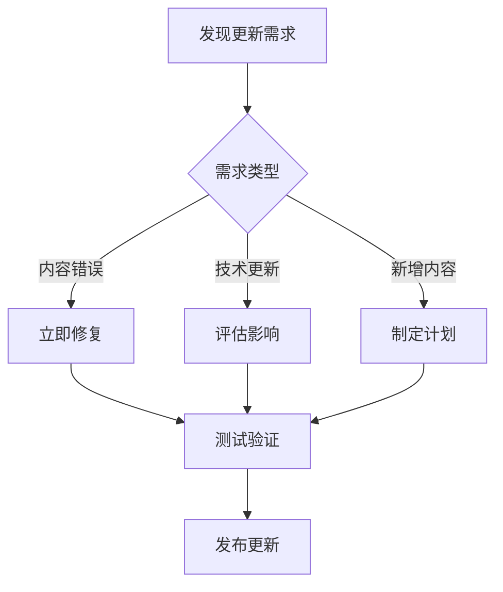
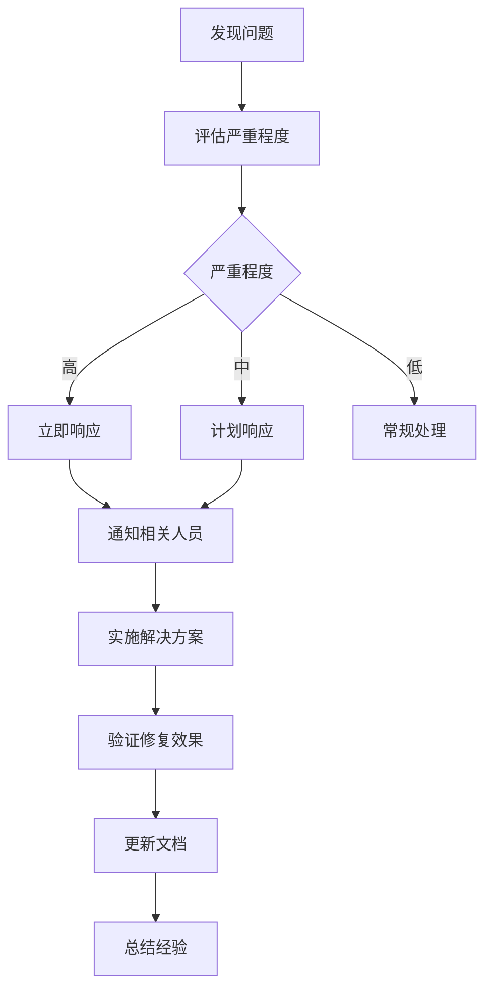

# 教学材料维护指南

## 概述

本维护指南提供了高通量测序数据分析课程教学材料的日常维护、更新和管理方法，确保教学材料始终保持最新状态和高质量标准。

## 维护职责

### 主要维护者
- **课程负责人**：王运生
- **技术维护**：指定的技术人员
- **内容审核**：学科专家团队
- **质量控制**：教学质量监督小组

### 维护分工
1. **内容维护**：更新理论知识、实践案例
2. **技术维护**：软件版本更新、脚本修复
3. **格式维护**：样式统一、模板更新
4. **质量维护**：错误修正、性能优化

## 日常维护任务

### 每周任务
- [ ] 检查外部链接有效性
- [ ] 验证代码示例可执行性
- [ ] 收集学生反馈和问题
- [ ] 更新软件版本信息

### 每月任务
- [ ] 全面检查内容准确性
- [ ] 更新相关文献和资源
- [ ] 优化图片和图表质量
- [ ] 备份所有教学材料

### 每学期任务
- [ ] 根据教学反馈调整内容
- [ ] 更新软件工具和版本
- [ ] 重新生成所有幻灯片和手册
- [ ] 进行完整的质量审核

### 每年任务
- [ ] 全面更新课程内容
- [ ] 跟踪技术发展趋势
- [ ] 重新设计视觉样式
- [ ] 制定下一年度改进计划

## 内容更新流程

### 1. 需求识别


### 2. 更新优先级
- **紧急**：内容错误、安全问题
- **高优先级**：软件版本更新、重要功能
- **中优先级**：内容优化、新增案例
- **低优先级**：样式调整、文档完善

### 3. 更新步骤
1. **创建分支**：`git checkout -b update/[description]`
2. **进行修改**：按照标准格式进行内容更新
3. **质量检查**：运行验证脚本和人工审核
4. **测试验证**：在测试环境中验证修改
5. **合并发布**：合并到主分支并发布

## 版本管理

### 版本号规范
采用语义化版本控制 (Semantic Versioning)：
- **主版本号**：重大内容改动或架构变更
- **次版本号**：新增课程内容或重要功能
- **修订版本号**：错误修复和小幅改进

### 版本发布流程
```bash
# 1. 更新版本号
echo "v1.2.3" > VERSION

# 2. 更新变更日志
vim CHANGELOG.md

# 3. 提交版本更新
git add .
git commit -m "chore: bump version to v1.2.3"

# 4. 创建版本标签
git tag -a v1.2.3 -m "Release version 1.2.3"

# 5. 推送到GitHub仓库
git push origin main --tags
# 推送到 https://github.com/hnnd/ngs-for-master
```

### 分支管理策略
- **main**：稳定的生产版本
- **develop**：开发版本，集成新功能
- **feature/**：功能开发分支
- **hotfix/**：紧急修复分支
- **release/**：版本发布准备分支

## 质量保证

### 自动化检查
```bash
# 运行完整的质量检查
./scripts/validators/check_all.sh

# 检查链接有效性
./scripts/validators/check_links.py

# 验证代码语法
./scripts/validators/validate_code.py

# 检查格式规范
./scripts/validators/check_format.py
```

### 手动审核清单
- [ ] 内容科学准确性
- [ ] 操作步骤可重现性
- [ ] 图片显示正确性
- [ ] 代码语法正确性
- [ ] 格式规范一致性
- [ ] 链接有效性
- [ ] 中文字符显示

### 测试环境
1. **本地测试**：开发者本地验证
2. **集成测试**：CI/CD自动化测试
3. **用户测试**：教师和学生试用
4. **生产验证**：正式环境最终检查

## 备份和恢复

### 备份策略
```bash
# 每日自动备份脚本
#!/bin/bash
DATE=$(date +%Y%m%d)
BACKUP_DIR="/backup/ngs-course-materials"

# 创建备份目录
mkdir -p "$BACKUP_DIR/$DATE"

# 备份源文件
tar -czf "$BACKUP_DIR/$DATE/source-$DATE.tar.gz" \
    --exclude='.git' \
    --exclude='node_modules' \
    ngs-course-materials/

# 备份生成的文件
tar -czf "$BACKUP_DIR/$DATE/generated-$DATE.tar.gz" \
    generated-materials/

# 清理30天前的备份
find "$BACKUP_DIR" -type d -mtime +30 -exec rm -rf {} \;
```

### 恢复流程
1. **确定恢复点**：选择合适的备份版本
2. **停止服务**：暂停相关服务和访问
3. **恢复数据**：从备份中恢复文件
4. **验证完整性**：检查恢复的数据完整性
5. **重启服务**：恢复正常服务

### 灾难恢复
- **异地备份**：云存储和异地服务器
- **版本控制**：Git仓库作为备份手段
- **文档记录**：详细的恢复操作文档
- **定期演练**：定期进行恢复演练

## 性能优化

### 文件大小优化
```bash
# 压缩图片文件
find assets/images -name "*.png" -exec pngquant --ext .png --force {} \;

# 优化SVG文件
find assets/images -name "*.svg" -exec svgo {} \;

# 压缩PDF文件
find courses -name "*.pdf" -exec gs -sDEVICE=pdfwrite -dCompatibilityLevel=1.4 \
    -dPDFSETTINGS=/ebook -dNOPAUSE -dQUIET -dBATCH \
    -sOutputFile={}.compressed {} \;
```

### 生成速度优化
- **并行处理**：使用多进程生成幻灯片
- **增量更新**：只重新生成修改的内容
- **缓存机制**：缓存中间结果和资源
- **资源优化**：压缩和优化静态资源

### 访问性能优化
- **CDN加速**：使用内容分发网络
- **文件压缩**：启用gzip压缩
- **缓存策略**：设置合适的缓存头
- **懒加载**：按需加载大型资源

## 监控和报告

### 使用统计
```python
# 统计脚本示例
import os
import json
from datetime import datetime

def generate_usage_report():
    """生成使用情况报告"""
    report = {
        'timestamp': datetime.now().isoformat(),
        'courses': {},
        'files': {},
        'errors': []
    }
    
    # 统计课程文件
    for course_dir in os.listdir('courses'):
        course_path = os.path.join('courses', course_dir)
        if os.path.isdir(course_path):
            report['courses'][course_dir] = {
                'slides': count_files(course_path, '*.md'),
                'manuals': count_files(course_path, 'manual.md'),
                'scripts': count_files(course_path, '*.py', '*.sh', '*.R'),
                'images': count_files(course_path, '*.svg', '*.png')
            }
    
    return report
```

### 错误监控
- **日志收集**：收集生成和访问日志
- **错误追踪**：自动检测和报告错误
- **性能监控**：监控生成时间和资源使用
- **用户反馈**：收集和分析用户反馈

### 定期报告
- **周报**：基本统计和问题汇总
- **月报**：详细分析和改进建议
- **季报**：趋势分析和发展规划
- **年报**：全面评估和战略调整

## 团队协作

### 协作工具
- **版本控制**：Git + GitHub (https://github.com/hnnd/ngs-for-master)
- **项目管理**：GitHub Issues跟踪和里程碑
- **文档协作**：Markdown + GitHub在线编辑
- **沟通工具**：邮件、即时消息、视频会议

### 工作流程
1. **需求提出**：通过Issue提出需求或问题
2. **任务分配**：指定负责人和截止时间
3. **开发实施**：在功能分支上进行开发
4. **代码审查**：通过Pull Request进行审查
5. **测试验证**：在测试环境中验证
6. **部署发布**：合并到主分支并发布

### 知识管理
- **文档维护**：保持文档的及时更新
- **经验分享**：定期分享最佳实践
- **培训计划**：新成员培训和技能提升
- **知识库**：建立常见问题和解决方案库

## 应急响应

### 紧急情况类型
1. **系统故障**：服务器宕机、网络中断
2. **数据丢失**：文件损坏、误删除
3. **安全事件**：数据泄露、恶意攻击
4. **内容错误**：严重的内容错误或误导信息

### 应急响应流程


### 联系方式
- **紧急联系人**：王运生教授 (wangys@hunau.edu.cn)
- **技术支持**：[技术人员联系方式]
- **管理员**：[系统管理员联系方式]

## 改进建议

### 持续改进
1. **定期评估**：每学期评估维护效果
2. **流程优化**：根据实际情况优化流程
3. **工具升级**：采用更好的工具和技术
4. **标准更新**：更新维护标准和规范

### 创新探索
- **自动化程度**：提高自动化水平
- **智能化工具**：引入AI辅助工具
- **云端服务**：迁移到云端平台
- **移动支持**：优化移动端体验

这个维护指南确保了教学材料的长期稳定性和持续改进，为高质量的教学提供了可靠的技术保障。